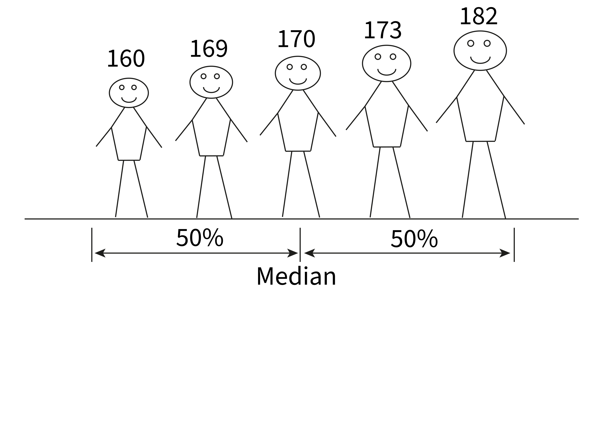
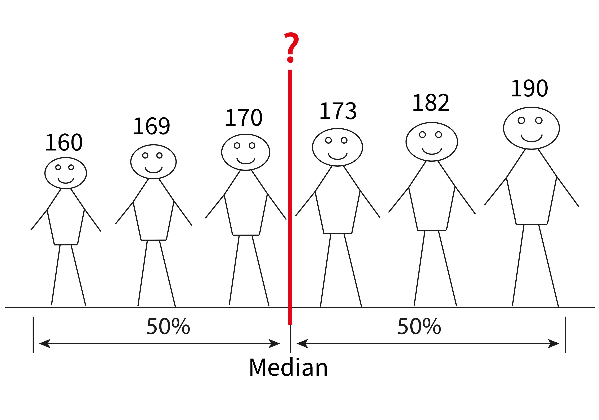
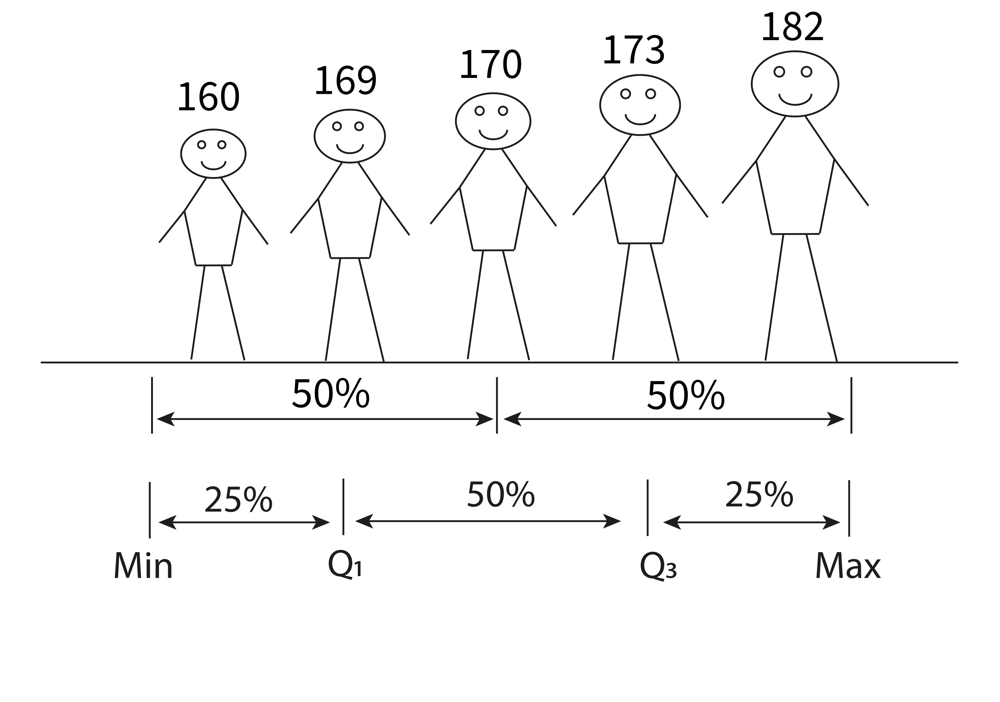
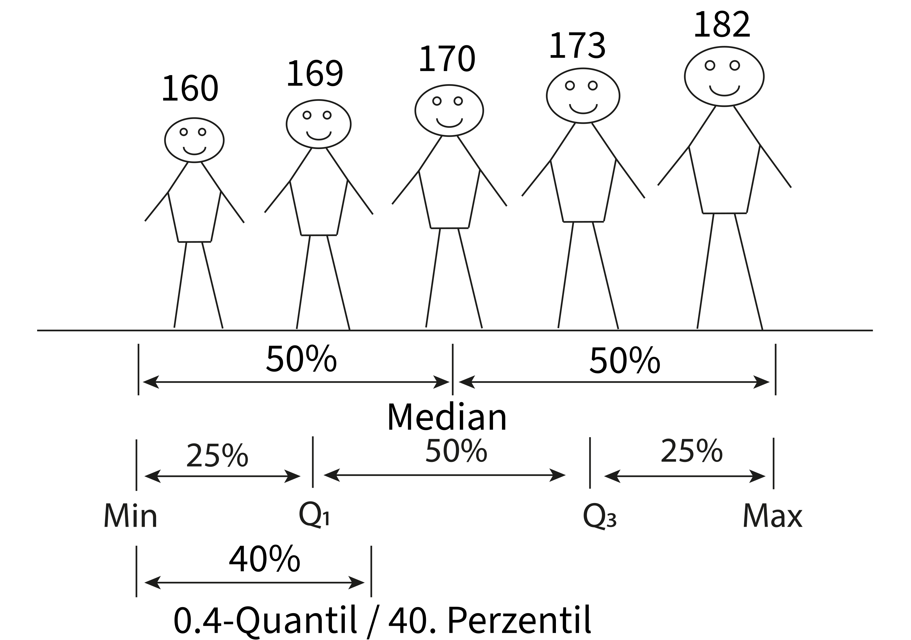
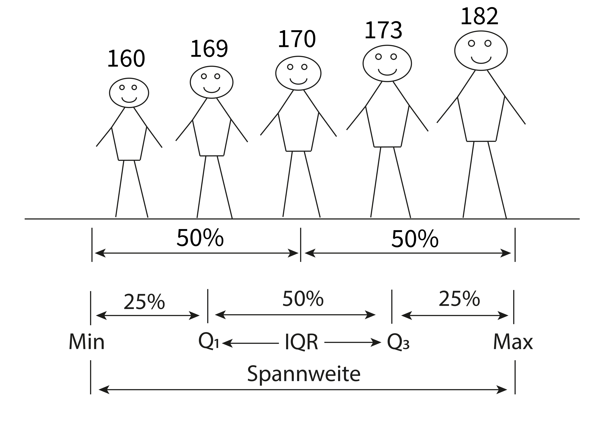

## Inhalte {.smaller}

- Grundbegriffe
- Qualitative und quantitative Daten: Variablentypen
- Kennzahlen der Lage und Streuung
  - Mittelwert, Median, Perzentile/Quantile
  - Varianz, Standardabweichung, Interquartilsabstand, Spannweite
  - Absolute und relative Häufigkeiten
- Grafische Darstellung
  - Histogramm
  - Boxplot
  - Balkendiagramm
  - Kreuztabelle

## Modul Angewandte Statistik {.smaller}


::: {.callout-note}
## Inferenzielle (schliessende) Statistik

- Schätzen von wahren Kennzahlen (z.B. Mittelwert) in der Population (auch Grundgesamtheit).
- Verallgemeinerung der Stichproben-Kennzahlen: Benötigt eine repräsentative Zufallsstichprobe.
- Liefert Angaben bis zu welchem Grad man den Schätzungen vertrauen kann.

:::

{fig-align="center" height=50mm}

::: {.callout-note}
## Deskriptive (beschreibende) Statistik

- Daten einer Stichprobe (engl. sample) zusammenfassend beschreiben. Keine Verallgemeinerung der Ergebnisse.
- Kennzahlen der Lage (z.B. Mittelwert, Median) und Streuung (z.B. Standardabweichung, Interquartilsabstand).
- Grafisch: Boxplot und Histogramm, Tabellarisch: Kreuztabellen.

:::

## Grundbegriffe {.smaller}

:::: {.columns}

::: {.column width="50%"}

::: {.callout-note}
## Beobachtungseinheit

- Objekte, an denen Merkmale gemessen werden.
- Zeilen in Datentabelle.

:::

::: {.callout-note}
## Beobachtungsmerkmal/Variable

- Beobachtetes oder gemessenes Merkmal einer Beobachtungseinheit (z.B. Körpergrösse)
- Spalte in Datentabelle

:::

::: {.callout-note}
## Merkmalsausprägungen

- Konkrete Werte von Beobachtungsmerkmalen (z.B. Körpergrösse = 170 cm)
- Wert in Zelle in Datentabelle

:::
:::


::: {.column width="50%"}

```{r}
library(tidyverse)
library(kableExtra)
library(rio)
library(patchwork)
library(ggbrace)
library(gamlss)
library(pastecs) # descriptive statistics of data frame
ggred <- "#F8766D"
ggblue <- "#00BFC4"
gggreen <- "#7CAE00"
ggviolet <- "#C77CFF"
df.stud <- import("../data/01-physio.csv")
df.stud <- df.stud |>
    mutate(
        Kohorte = extract_numeric(Kohorte),
        Groesse = as.numeric(Groesse),
        Gewicht = as.numeric(Gewicht),
        Geschwister = as.integer(sample(0:4, nrow(df.stud), prob = c(0.2, 0.3, 0.3, 0.1, 0.1), replace = TRUE)),
        Kohorte = as.factor(Kohorte),
        Geschlecht = as.factor(Geschlecht),
        Augenfarbe = as.factor(Augenfarbe),
        Klasse = as.factor(Klasse)
    )
df.stud_w <- df.stud |>
    filter(Geschlecht == "w")
head(df.stud, 5) |>
    select(c(ID, Augenfarbe, Groesse, Gewicht)) |>
    kableExtra::kable()
```
:::

::::

## Merkmalstypen (Skalenniveaus) {.smaller}

| Typ                        | Beschreibung                            | Beispiel                                         |
|----------------------------|-----------------------------------------|--------------------------------------------------|
| qualitativ-nominal         | Daten bilden **ungeordnete** Kategorien | Augenfarbe, Kanton                               |
| qualitativ-ordinal         | Daten bilden **geordnete** Kategorien   | Schmerzen (wenig, mittel, stark), Kleidergrössen |
|                            |                                         |                                                  |
| quantitativ-diskret        | Daten werden **gezählt**                | Anzahl Geschwister, Anzahl Studierende           |
| quantitativ-kontinuierlich | Daten werden **gemessen**               | Körpergewicht, Blutdruck                         |

::: {.callout-note}
## Art des Nullpunktes bei quantitativ-kontinuierlich

- Rationalskaliert: 0 ist ein absoluter Wert (z.B. Alter, Gewicht). Verhältnisse bilden möglich: 100 kg sind doppelt so schwer wie 50 kg.
- Intervallskaliert: 0 ist ein willkürlicher Wert (z.B. Temperatur Celsius-Skala: 0 heisst nicht keine Wärme). Verhältnisse bilden nicht möglich: 10° C ist nicht doppelt so warm wie 5° C.

:::

::: {.notes}
- Rational: Verhältnisse bilden möglich.
- Intervall: 0 Grad heisst nicht keine Wärme. IQ = 0 heisst nicht keine Intelligenz.
:::

# Quantitative Merkmale

:::: {.columns}

::: {.column width="50%"}

::: {.callout-note}
## Lagekennzahlen

- Mittelwert
- Median
- Perzentile/Quantile
:::

::: {.callout-note}
## Streuungskennzahlen

- Varianz/Standardabweichung
- Interquartilsabstand
- Spannweite (Variationsbreite)
:::

:::


::: {.column width="50%"}


```{r}
#| out.width: "80%"
#| fig.align: "center"
ggplot(df.stud, aes(x = Groesse)) +
    geom_histogram(color = "white", fill = "darkgrey", binwidth = 5) +
    xlab("Körpergrösse (cm)") +
    ylab("Häufigkeit") +
    annotate("label",
        x = 170, y = 15, label = "Histogramm",
        angle = 0, colour = "steelblue", fill = "white", size = 12
    ) +
    theme(text = element_text(size = 22))
ggplot(df.stud, mapping = aes(x = "", y = Groesse)) +
    geom_boxplot(outlier.shape = 8, outlier.size = 3, outlier.color = "red") +
    ## geom_jitter(position = position_jitter(0.2), size=3) +
    labs(y = "Körpergrösse (cm)", x = "") +
    annotate("label",
        x = 1, y = 180, label = "Boxplot",
        angle = 0, colour = "steelblue", fill = "white", size = 12
    ) +
    theme(text = element_text(size = 22))
```
:::
::::

## Quantitative Merkmale

:::: {.columns}

::: {.column width="50%"}

::: {.callout-note}
## Lagekennzahlen

- Mittelwert
- Median
- Perzentile/Quantile
:::

::: {.callout-note .transparent-30}
## Streuungskennzahlen

- Varianz/Standardabweichung
- Interquartilsabstand
- Spannweite (Variationsbreite)
:::

:::


::: {.column width="50%"}


```{r}
#| out.width: "80%"
#| fig.align: "center"
#| out.extra: 'class="transparent-30"'
ggplot(df.stud, aes(x = Groesse)) +
    geom_histogram(color = "white", fill = "darkgrey", binwidth = 5) +
    xlab("Körpergrösse (cm)") +
    ylab("Häufigkeit") +
    annotate("label",
        x = 170, y = 15, label = "Histogramm",
        angle = 0, colour = "steelblue", fill = "white", size = 12
    ) +
    theme(text = element_text(size = 22))
ggplot(df.stud, mapping = aes(x = "", y = Groesse)) +
    geom_boxplot(outlier.shape = 8, outlier.size = 3, outlier.color = "red") +
    ## geom_jitter(position = position_jitter(0.2), size=3) +
    labs(y = "Körpergrösse (cm)", x = "") +
    annotate("label",
        x = 1, y = 180, label = "Boxplot",
        angle = 0, colour = "steelblue", fill = "white", size = 12
    ) +
    theme(text = element_text(size = 22))
```
:::
::::

## Mittelwert {.smaller}

:::: {.columns}

::: {.column width="70%"}

Stichprobe von $n$ Beobachtungen $x_1, x_2, ..., x_n$
$$
\bar{x}=\frac{1}{n}\sum_{i=1}^{n}x_i = \frac{x_1+x_2+...+x_n}{n}
$$
:::

::: {.column width="30%"}
```{r}
head(df.stud, 5) |>
    select(c(ID, Groesse)) |>
    kableExtra::kable()
```
:::

::::

::: {.callout-note}
## Beispiel
$x_1=170,x_2=160,x_3=169,x_4=182,x_5=173$

$$
\bar{x}=\frac{170+160+169+182+173}{5} = 170.8
$$
:::

<!-- ## Einfluss extremer Werte auf den Mittelwert -->

<!-- ## Mittelwert als statistisches Modell -->

## Median

Der Median teilt die Stichprobe in zwei Hälften. 50% der Daten sind kleiner als der Median, 50% der Daten sind grösser als der Median. Der Median ist sozusagen der Wert in der Mitte.

{fig-align="center"}

## Median: Ungerades $n$ {.smaller}

:::: {.columns}

::: {.column width="50%"}

```{r}
head(df.stud, 5) |>
    select(c(ID, Groesse)) |>
    kableExtra::kable()
```
:::

::: {.column width="50%"}
```{r}
head(df.stud, 5) |>
    select(c(ID, Groesse)) |>
    arrange(Groesse) |>
    kableExtra::kable()
```
:::

::::

::: {.callout-note}
## Beispiel

$$
\begin{align*}
\tilde{x} &= x_{(\frac{n+1}{2})} \\
&= x_{(\frac{5+1}{2})} = x_{(3)} = 170
\end{align*}
$$
:::

## Median: Gerades $n$

:::: {.columns}

::: {.column width="50%"}

{fig-align="center"}
:::

::: {.column width="50%"}
{fig-align="center"}
:::

::::

## Median: Gerades $n$ (cont.) {.smaller}

:::: {.columns}

::: {.column width="50%"}
```{r}
head(df.stud, 6) |>
    select(c(ID, Groesse)) |>
    kableExtra::kable()
```
:::

::: {.column width="50%"}
```{r}
head(df.stud, 6) |>
    select(c(ID, Groesse)) |>
    arrange(Groesse) |>
    kableExtra::kable()
```
:::

::::


::: {.callout-note}
## Beispiel

$$
	\begin{align*}
	\tilde{x} &= \frac{1}{2}(x_{(\frac{n}{2})} + x_{(\frac{n}{2}+1)})\\
	&= \frac{1}{2}(x_{(\frac{6}{2})} + x_{(\frac{6}{2}+1))} = \frac{1}{2}(x_{(3)} + x_{(4)}) = \frac{1}{2}(173+174) = 173.5
	\end{align*}
$$
:::

## Min, Max & Quantile {.smaller}

:::: {.columns}

::: {.column width="50%"}
- Das Minimum $x_{(1)}$ und das Maximum $x_{(n)}$ beschreiben die Extremwerte.
- $Q_1$ (1. Quartil)
  - Teilt die Stichprobe im Verhältnis 1:3
  - 25\% aller Werte liegen darunter, 75\% darüber
- $Q_3$ (3. Quartil)
  - Teilt die Stichprobe im Verhältnis 3:1
  - 75\% aller Werte liegen darunter, 25\% darüber
:::

::: {.column width="50%"}
{fig-align="center"}
:::

::::

## Min, Max & Quantile {.smaller}

:::: {.columns}

::: {.column width="50%"}
- Das $\alpha$-Quantil $x_\alpha$ oder $100\alpha$\%-Perzentil teilt die Stichprobe im Verhältnis $\alpha:(1-\alpha)$
- $100\alpha$\% aller Werte liegen darunter, $100(1-\alpha)$\% darüber
- 1. Quartil: unteres Quartil / $x_{0.25}$ Quantil / 25. Perzentil
- 2. Quartil: Median / $x_{0.5}$ Quantil / 50. Perzentil
- 3. Quartil: oberes Quartil / $x_{0.75}$ / 75. Perzentil
:::

::: {.column width="50%"}
{fig-align="center"}
:::

::::

## Quantitative Merkmale

:::: {.columns}

::: {.column width="50%"}

::: {.callout-note .transparent-30}
## Lagekennzahlen

- Mittelwert
- Median
- Perzentile/Quantile
:::

::: {.callout-note}
## Streuungskennzahlen

- Varianz/Standardabweichung
- Interquartilsabstand
- Spannweite (Variationsbreite)
:::

:::


::: {.column width="50%"}


```{r}
#| out.width: "80%"
#| fig.align: "center"
#| out.extra: 'class="transparent-30"'
ggplot(df.stud, aes(x = Groesse)) +
    geom_histogram(color = "white", fill = "darkgrey", binwidth = 5) +
    xlab("Körpergrösse (cm)") +
    ylab("Häufigkeit") +
    annotate("label",
        x = 170, y = 15, label = "Histogramm",
        angle = 0, colour = "steelblue", fill = "white", size = 12
    ) +
    theme(text = element_text(size = 22))
ggplot(df.stud, mapping = aes(x = "", y = Groesse)) +
    geom_boxplot(outlier.shape = 8, outlier.size = 3, outlier.color = "red") +
    ## geom_jitter(position = position_jitter(0.2), size=3) +
    labs(y = "Körpergrösse (cm)", x = "") +
    annotate("label",
        x = 1, y = 180, label = "Boxplot",
        angle = 0, colour = "steelblue", fill = "white", size = 12
    ) +
    theme(text = element_text(size = 22))
```
:::
::::

## Spannweite und IQR

:::: {.columns}

::: {.column width="50%"}

::: {.callout-note}
## Spannweite/Variationsbreite

Misst den Wertebereich:

Spannweite = Max. - Min.

:::

::: {.callout-note}
## Interquartilsabstand (IQR)

Differenz zwischen 3. und 1. Quartil:

$\mathrm{IQR} = Q_3-Q_1$

:::
:::


::: {.column width="50%"}

{fig-align="center"}

:::

::::

## Varianz und Standardabweichung {.smaller}

:::: {.columns}

::: {.column width="70%"}

Varianz: Mittlere quadratische Abweichung der Daten vom Mittelwert.

$$
\begin{equation*}
s^2=\frac{1}{n-1}\sum_{i=1}^{n}(x_i-\bar{x})^2=\frac{(x_1-\bar{x})^2+...+(x_n-\bar{x})^2}{n-1}
\end{equation*}
$$

Standardabweichung: Quadratwurzel der Varianz.

$$
s=\sqrt{s^2}
$$


:::

::: {.column width="30%"}
```{r}
head(df.stud, 5) |>
    select(c(ID, Groesse)) |>
    kableExtra::kable()
```
:::

::::

```{r}
#| out.width: "60%"
#| fig.align: "center"
df <- df.stud[1:5, ]
mean_groesse <- mean(df$Groesse)
df$seg_len <- df$Groesse - mean_groesse # length of each vertical segment
df$mid_y <- (df$Groesse + mean_groesse) / 2 # vertical centre for the label
df$x_label <- as.numeric(df$ID) + 0.05 # shift a little to the right
ggplot(df, aes(x = ID, y = Groesse)) +
    geom_segment(
        aes(
            x = ID, xend = ID,
            y = mean_groesse, yend = Groesse
        ),
        colour = "steelblue", linewidth = 2
    ) +
    geom_point(colour = "darkred", size = 3) +
    geom_hline(
        yintercept = mean_groesse,
        linetype = "dashed", colour = "gray40", linewidth = 2
    ) +
    annotate("text",
        x = 0.5, y = mean_groesse,
        label = sprintf("Mean = %.2f", mean_groesse),
        hjust = 0, vjust = -1,
        colour = "gray40", size = 8
    ) +
    geom_label(
        aes(
            x = x_label, # shifted x‑position
            y = mid_y,
            label = sprintf("%.2f", seg_len)
        ),
        colour = "black", # text color
        fill = "white", # box background
        alpha = 0.7, # slight transparency
        size = 8,
        hjust = 0
    ) + # left‑justify so it sits right of the point
    labs(
        x = "ID",
        y = "Grösse (cm)"
    ) +
    theme(text = element_text(size = 22)) +
    xlim(0.5, 5.5)
```
## Varianz und Standardabweichung {.smaller}
```{r}
#| fig.align: "center"
df <- df.stud[1:5, ]
mean_groesse <- mean(df$Groesse)
df$seg_len <- df$Groesse - mean_groesse # length of each vertical segment
df$mid_y <- (df$Groesse + mean_groesse) / 2 # vertical centre for the label
df$x_label <- as.numeric(df$ID) + 0.05 # shift a little to the right
ggplot(df, aes(x = ID, y = Groesse)) +
    geom_segment(
        aes(
            x = ID, xend = ID,
            y = mean_groesse, yend = Groesse
        ),
        colour = "steelblue", linewidth = 2
    ) +
    geom_point(colour = "darkred", size = 3) +
    geom_hline(
        yintercept = mean_groesse,
        linetype = "dashed", colour = "gray40", linewidth = 2
    ) +
    annotate("text",
        x = 0.5, y = mean_groesse,
        label = sprintf("Mean = %.2f", mean_groesse),
        hjust = 0, vjust = -1,
        colour = "gray40", size = 8
    ) +
    geom_label(
        aes(
            x = x_label, # shifted x‑position
            y = mid_y,
            label = sprintf("%.2f", seg_len)
        ),
        colour = "black", # text color
        fill = "white", # box background
        alpha = 0.7, # slight transparency
        size = 8,
        hjust = 0
    ) + # left‑justify so it sits right of the point
    labs(
        x = "ID",
        y = "Grösse (cm)"
    ) +
    theme(text = element_text(size = 22)) +
    xlim(0.5, 5.5)
```

::: {.callout-note}
## Beispiel
$$
\begin{equation*}
s^2=\frac{1}{n-1}\sum_{i=1}^{n}(x_i-\bar{x})^2=\frac{(x_1-\bar{x})^2+...+(x_n-\bar{x})^2}{n-1}
\end{equation*}
$$
$$
s^2=\frac{(170-170.8)^2+(160-170.8)^2+(169-170.8)^2+(182-170.8)^2+(173-170.8)^2}{4}= 62.7
$$

$$
s=\sqrt{62.7}=7.9
$$
:::

## Quantitative Merkmale

:::: {.columns}

::: {.column width="50%"}

::: {.callout-note .transparent-30}
## Lagekennzahlen

- Mittelwert
- Median
- Perzentile/Quantile
:::

::: {.callout-note .transparent-30}
## Streuungskennzahlen

- Varianz/Standardabweichung
- Interquartilsabstand
- Spannweite (Variationsbreite)
:::
:::

::: {.column width="50%"}
```{r}
#| out.width: "80%"
#| fig.align: "center"
ggplot(df.stud, aes(x = Groesse)) +
    geom_histogram(color = "white", fill = "darkgrey", binwidth = 5) +
    xlab("Körpergrösse (cm)") +
    ylab("Häufigkeit") +
    annotate("label",
        x = 170, y = 15, label = "Histogramm",
        angle = 0, colour = "steelblue", fill = "white", size = 12
    ) +
    theme(text = element_text(size = 22))
ggplot(df.stud, mapping = aes(x = "", y = Groesse)) +
    geom_boxplot(outlier.shape = 8, outlier.size = 3, outlier.color = "red") +
    ## geom_jitter(position = position_jitter(0.2), size=3) +
    labs(y = "Körpergrösse (cm)", x = "") +
    annotate("label",
        x = 1, y = 180, label = "Boxplot",
        angle = 0, colour = "steelblue", fill = "white", size = 12
    ) +
    theme(text = element_text(size = 22))
```
:::
::::

## Histogramm

```{r}
#| out.width: "80%"
#| fig.align: "center"
#| fig-cap: "Körpergrösse von Frauen, n = 183"
p1 <- ggplot(df.stud_w, aes(x = Groesse)) +
    geom_histogram(color = "white", fill = "darkgrey", binwidth = 1) +
    xlab("(A) Grösse (cm)") +
    ylab("Anzahl") +
    theme_grey()

p2 <- ggplot(df.stud_w, aes(x = Groesse)) +
    geom_histogram(color = "white", fill = "darkgrey", binwidth = 2) +
    xlab("(B) Grösse (cm)") +
    ylab("Anzahl") +
    theme_grey()

p3 <- ggplot(df.stud_w, aes(x = Groesse)) +
    geom_histogram(color = "white", fill = "darkgrey", binwidth = 5) +
    xlab("(C) Grösse (cm)") +
    ylab("Anzahl") +
    theme_grey()

p4 <- ggplot(df.stud_w, aes(x = Groesse)) +
    geom_histogram(color = "white", fill = "darkgrey", binwidth = 10) +
    xlab("(D) Grösse (cm)") +
    ylab("Anzahl") +
    theme_grey()

(p1 | p2) /
    (p3 | p4)
```
## Boxplot

```{r}
#| out.width: "80%"
#| fig.align: "center"
#| fig-cap: "Körpergrösse von Frauen, n = 183"
median_groesse <- median(df.stud_w$Groesse)
q1_groesse <- quantile(df.stud_w$Groesse, 0.25)
q3_groesse <- quantile(df.stud_w$Groesse, 0.75)
iqr_groesse <- q3_groesse - q1_groesse
## p1 <- ggplot(df.stud_w,mapping=aes(x="",y=Groesse)) +
##   geom_boxplot(outlier.shape = 8, outlier.size = 3, outlier.color = "red") +
##   geom_jitter(position = position_jitter(0.2), size=1) +
##   labs(y="Körpergrösse (cm)", x="") +
##   theme_minimal() +
##   coord_cartesian(xlim = c(0, 2.5))
p2 <- ggplot(df.stud_w, mapping = aes(x = "", y = Groesse)) +
    geom_boxplot(outlier.shape = 8, outlier.size = 3, outlier.color = "red") +
    geom_jitter(position = position_jitter(0.2), size = 1) +
    labs(y = "Körpergrösse (cm)", x = "") +
    stat_brace(
        data = data.frame(x = c(1.3, 1.9), y = c(q1_groesse, q3_groesse)),
        aes(x, y),
        rotate = 90, size = 0.7, col = "steelblue"
    ) +
    ## annotate("text",
    ##          x = 2.5, y = mean(c(q1_groesse, q3_groesse)),
    ##          label = "IQR",
    ##          hjust = 0, vjust = 0.5,
    ##          colour = "gray40", size = 6) +
    geom_label(
        aes(
            x = 2.5, # shifted x‑position
            y = mean(c(q1_groesse, q3_groesse)),
            label = "IQR"
        ),
        colour = "black", # text color
        fill = "white", # box background
        alpha = 0.7, # slight transparency
        size = 6,
        hjust = 0
    ) + # left‑justify so it sits right of the point
    stat_brace(
        data = data.frame(x = c(1.3, 1.9), y = c(q3_groesse, q3_groesse + 1.5 * iqr_groesse)),
        aes(x, y),
        rotate = 90, size = .7, col = "steelblue"
    ) +
    ## annotate("text",
    ##          x = 2.5, y = mean(c(q3_groesse, q3_groesse + 1.5*iqr_groesse)),
    ##          label = "1.5 IQR",
    ##          hjust = 0, vjust = 0.5,
    ##          colour = "gray40", size = 6) +
    geom_label(
        aes(
            x = 2.5, # shifted x‑position
            y = mean(c(q3_groesse, q3_groesse + 1.5 * iqr_groesse)),
            label = "1.5 IQR"
        ),
        colour = "black", # text color
        fill = "white", # box background
        alpha = 0.7, # slight transparency
        size = 6,
        hjust = 0
    ) + # left‑justify so it sits right of the point
    stat_brace(
        data = data.frame(x = c(1.3, 1.9), y = c(q1_groesse - 1.5 * iqr_groesse, q1_groesse)),
        aes(x, y),
        rotate = 90, size = .7, col = "steelblue"
    ) +
    ## annotate("text",
    ##          x = 2.5, y = mean(c(q1_groesse, q1_groesse - 1.5*iqr_groesse)),
    ##          label = "1.5 IQR",
    ##          hjust = 0, vjust = 0.5,
    ##          colour = "gray40", size = 6) +
    geom_label(
        aes(
            x = 2.5, # shifted x‑position
            y = mean(c(q1_groesse, q1_groesse - 1.5 * iqr_groesse)),
            label = "1.5 IQR"
        ),
        colour = "black", # text color
        fill = "white", # box background
        alpha = 0.7, # slight transparency
        size = 6,
        hjust = 0
    ) + # left‑justify so it sits right of the point
    ## annotate("text",
    ##          x = 1.5, y = median_groesse,
    ##          label = "Median",
    ##          hjust = 0, vjust = 0.5,
    ##          colour = "gray40", size = 6) +
    geom_label(
        aes(
            x = 1.5, # shifted x‑position
            y = median_groesse,
            label = "Median"
        ),
        colour = "black", # text color
        fill = "white", # box background
        alpha = 0.7, # slight transparency
        size = 6,
        hjust = 0
    ) + # left‑justify so it sits right of the point
    ## annotate("text",
    ##          x = 1.5, y = q1_groesse,
    ##          label = "1. Quartil",
    ##          hjust = 0, vjust = 0.5,
    ##          colour = "gray40", size = 6) +
    geom_label(
        aes(
            x = 1.5, # shifted x‑position
            y = q1_groesse,
            label = "1. Quartil"
        ),
        colour = "black", # text color
        fill = "white", # box background
        alpha = 0.7, # slight transparency
        size = 6,
        hjust = 0
    ) + # left‑justify so it sits right of the point
    ## annotate("text",
    ##          x = 1.5, y = q3_groesse,
    ##          label = "3. Quartil",
    ##          hjust = 0, vjust = .5,
    ##          colour = "gray40", size = 6) +
    geom_label(
        aes(
            x = 1.5, # shifted x‑position
            y = q3_groesse,
            label = "3. Quartil"
        ),
        colour = "black", # text color
        fill = "white", # box background
        alpha = 0.7, # slight transparency
        size = 6,
        hjust = 0
    ) + # left‑justify so it sits right of the point
    theme(text = element_text(size = 22)) +
    coord_cartesian(xlim = c(0, 3))
## (p1 | p2)
p2
```

::: {.notes}
- Wichtige Darstellungsmöglichkeit für quantitative Daten.
- Auch Box-Whisker-Plot genannt.
- Als Richtwert ab einer Stichprobengrösse von $n=15$ einsetzen. Ansonsten Streudiagramm verwenden um einzelne Datenpunkte darzustellen.
- Überlagerung mit einzelnen Datenpunkten bei kleinen Stichproben sinnvoll.
- Symmetrie der Daten: Whiskers etwa gleich lang
:::

## Histogramm vs. Boxplot

```{r}
#| out.width: "80%"
#| fig.align: "center"
#| fig-cap: "Körpergrösse, n = 228"
p1 <- ggplot(df.stud, aes(x = Groesse)) +
    geom_histogram(color = "white", fill = "darkgrey", binwidth = 2) +
    xlab("") +
    ylab("Häufigkeit") +
    theme(text = element_text(size = 22))
p2 <- ggplot(df.stud, mapping = aes(x = Groesse, y = "")) +
    geom_boxplot(outlier.shape = 8, outlier.size = 3, outlier.color = "red") +
    labs(y = "", x = "Körpergrösse (cm)") +
    theme(text = element_text(size = 22))
p1 / p2
```

## Robustheit


```{r}
#| out.width: "80%"
#| fig.align: "center"
alter <- c(
    18, 19, 20, 21, 21, 22, 22, 23, 23, 24, 26,
    18, 19, 20, 21, 21, 22, 22, 23, 23, 24, 26, 36, 37
)

gruppe <- factor(c(
    rep("a", 11),
    rep("b", 13)
))
alter_tib <- tibble(
    Alter = alter,
    gruppe = gruppe
)

m_alter <- alter_tib |>
    group_by(gruppe) |>
    summarise(
        m = round(mean(Alter), 1),
        median = median(Alter),
        s = sd(Alter),
        q1 = quantile(Alter, 0.25),
        q3 = quantile(Alter, 0.75),
        iqr = IQR(Alter),
        min = min(Alter),
        max = max(Alter)
    )

p1 <- alter_tib |>
    filter(gruppe == "a") |>
    group_by(gruppe) |>
    ggplot(aes(x = Alter)) +
    geom_dotplot(binwidth = 1, fill = ggblue) +
    ylab("") +
    xlab("") +
    scale_y_continuous(breaks = NULL) +
    xlim(c(18, 37)) +
    theme(text = element_text(size = 22))

p1m <- p1 +
    annotate("text",
        m_alter$m[1],
        y = 0.7,
        label = sprintf("Mean = %.1f", m_alter$m[1]),
        hjust = -0.1, vjust = 0,
        colour = "gray40", size = 6
    ) +
    annotate("text",
        m_alter$m[1],
        y = 0.5,
        label = sprintf("SD = %.1f", m_alter$s[1]),
        hjust = -0.1, vjust = 0,
        colour = "gray40", size = 6
    ) +
    geom_vline(xintercept = m_alter$m[1], color = "gray40", linewidth = 1) +
    theme(text = element_text(size = 22))

p2 <- alter_tib |>
    filter(gruppe == "b") |>
    group_by(gruppe) |>
    ggplot(aes(x = Alter)) +
    geom_dotplot(binwidth = 1, fill = ggblue) +
    ylab("") +
    xlab("") +
    scale_y_continuous(breaks = NULL) +
    xlim(c(18, 37)) +
    theme(text = element_text(size = 22))

p2m <- p2 +
    annotate("text",
        m_alter$m[2],
        y = 0.7,
        label = sprintf("Mean = %.1f", m_alter$m[2]),
        hjust = -0.1, vjust = 0,
        colour = "gray40", size = 6
    ) +
    annotate("text",
        m_alter$m[2],
        y = 0.5,
        label = sprintf("SD = %.1f", m_alter$s[2]),
        hjust = -0.1, vjust = 0,
        colour = "gray40", size = 6
    ) +
    geom_vline(xintercept = m_alter$m[2], color = "gray40", linewidth = 1) +
    theme(text = element_text(size = 22))

p3 <- alter_tib |>
    filter(gruppe == "a") |>
    group_by(gruppe) |>
    ggplot(aes(x = Alter)) +
    geom_dotplot(binwidth = 1, fill = ggblue) +
    xlab("") +
    scale_y_continuous(breaks = NULL) +
    xlim(c(18, 37)) +
    theme(text = element_text(size = 22))

p3m <- p1 +
    annotate("text",
        m_alter$median[1],
        y = 0.7,
        label = sprintf("Median = %.1f", m_alter$median[1]),
        hjust = -0.1, vjust = 0,
        colour = "gray40", size = 6
    ) +
    annotate("text",
        m_alter$median[1],
        y = 0.5,
        label = sprintf("IQR = %.1f", m_alter$iqr[1]),
        hjust = -0.1, vjust = 0,
        colour = "gray40", size = 6
    ) +
    geom_vline(xintercept = m_alter$median[1], color = "gray40", linewidth = 1) +
    xlab("alter") +
    theme(text = element_text(size = 22))

p4 <- alter_tib |>
    filter(gruppe == "b") |>
    group_by(gruppe) |>
    ggplot(aes(x = alter)) +
    geom_dotplot(binwidth = 1, fill = ggblue) +
    xlab("") +
    scale_y_continuous(breaks = NULL) +
    xlim(c(18, 37)) +
    theme(text = element_text(size = 22))

p4m <- p2 +
    ## geom_text(x=m_alter$median[2]+2, y=.5, label= m_alter$median[2], color = ggred, size = 6) +
    annotate("text",
        m_alter$median[2],
        y = 0.7,
        label = sprintf("Median = %.1f", m_alter$median[2]),
        hjust = -0.1, vjust = 0,
        colour = "gray40", size = 6
    ) +
    annotate("text",
        m_alter$median[2],
        y = 0.5,
        label = sprintf("IQR = %.1f", m_alter$iqr[2]),
        hjust = -0.1, vjust = 0,
        colour = "gray40", size = 6
    ) +
    geom_vline(xintercept = m_alter$median[2], color = "gray40", linewidth = 1) +
    xlab("alter") +
    theme(text = element_text(size = 22))

(p1m | p2m) /
    (p3m | p4m)
```

## Symmetrie und Schiefe

```{r}

set.seed(10)
n <- 500 # Number of samples to draw from distribution
binwidth <- 0.3

########## Samples from an exponential distribution ###########
# z.B. Beantwortung der Frage nach der Dauer von zufälligen Zeitintervallen
# (Zeit zwischen Anrufen, Lebensdauer von Atomen beim radioaktiven Zerfall,
# Lebensdauer von Bautteilen)
expsamples <- rexp(n, rate = 2)
# hist(expsamples)

########## Samples from a left skewed beta distribution ##########
p <- 5
q <- 2
betasamples <- rbeta(n, p, q)
# hist(betasamples)

######### Samples from a uniform distribution ###########
unisamples <- runif(n, min = 0, max = 1)
# hist(unisamples)

######### Samples from a binomial distribution ##########
binsamples <- rbinom(n, 10, 0.1)

####### Samples from a normal distribution ########
mn <- 0
sd <- 1
# normsamples <- rnorm(n,mean=mn,sd=sd)
# The rSHASH function from the GAMLSS package lets us to
# draw samples from skewed and arced normal distibutions.
normsamples <- rSHASHo(n, mu = mn, sigma = sd, nu = 0, tau = 1)

######### Skewed normal ##########
negskewsamples <- rSHASHo(n, mu = mn, sigma = sd, nu = -1, tau = 1)
posskewsamples <- rSHASHo(n, mu = mn, sigma = sd, nu = 1, tau = 1)

######### Kurtosis normal ##########
negkurtsamples <- rSHASHo(n, mu = mn, sigma = sd, nu = 0, tau = 1.2)
poskurtsamples <- rSHASHo(n, mu = mn, sigma = sd, nu = 0, tau = 0.8)

###### Put all in a data frame ######
distrdf <- data.frame(
    normsamples,
    expsamples,
    betasamples,
    unisamples,
    binsamples,
    posskewsamples,
    negskewsamples,
    poskurtsamples,
    negkurtsamples
)

# Save values for exercises
exportdf <- dplyr::select(distrdf, c(
    normsamples,
    posskewsamples,
    negskewsamples,
    poskurtsamples,
    negkurtsamples
))
names(exportdf) <- c("Data1", "Data2", "Data3", "Data4", "Data5")
## write.csv(exportdf,"Ex_Part2_ExampleDistributions.csv")

xmin <- -4
xmax <- 4
fsize <- 15
mean_norm <- mean(normsamples)
median_norm <- median(normsamples)
mean_posskew <- mean(posskewsamples)
median_posskew <- median(posskewsamples)
mean_negskew <- mean(negskewsamples)
median_negskew <- median(negskewsamples)
plt_norm_hist_nolabels <- ggplot(distrdf, aes(x = normsamples)) +
    # geom_histogram(binwidth = binwidth, colour="black", fill="white") +
    geom_histogram(aes(y = ..density..), binwidth = binwidth, colour = "black", fill = "white") +
    # geom_density(colour="blue") +
    ## stat_function(
    ##   fun = function(x, mean, sd) {
    ##     dnorm(x=x, mean=mean, sd=sd)}, args = c(mean = mn, sd = sd), colour="blue") +
    geom_vline(xintercept = mean_norm, color = "gray40", linewidth = 1) +
    geom_vline(xintercept = median_norm, color = "gray40", linewidth = 1, linetype = "dashed") +
    labs(x = "", y = "", title = "Symmertrisch") +
    theme(text = element_text(size = fsize)) +
    xlim(xmin, xmax)

plt_skewedpos_hist_nolabels <- ggplot(distrdf, aes(x = posskewsamples)) +
    # geom_histogram(binwidth = binwidth, colour="black", fill="white") +
    geom_histogram(aes(y = ..density..), binwidth = binwidth, colour = "black", fill = "white") +
    # geom_density(colour="blue") +
    ## stat_function(
    ##   fun = function(x, mean, sd) {
    ##     dnorm(x=x, mean=mean, sd=sd)
    ##   },
    ##   args = c(mean = mn, sd = sd), colour="blue") +
    geom_vline(xintercept = mean_posskew, color = "gray40", linewidth = 1) +
    geom_vline(xintercept = median_posskew, color = "gray40", linewidth = 1, linetype = "dashed") +
    labs(x = "", y = "", title = "Rechtsschief") +
    theme(text = element_text(size = fsize)) +
    xlim(xmin, xmax)

plt_skewedneg_hist_nolabels <- ggplot(distrdf, aes(x = negskewsamples)) +
    # geom_histogram(binwidth = binwidth, colour="black", fill="white") +
    geom_histogram(aes(y = ..density..), binwidth = binwidth, colour = "black", fill = "white") +
    # geom_density(colour="blue") +
    ## stat_function(
    ##   fun = function(x, mean, sd) {
    ##     dnorm(x=x, mean=mean, sd=sd)
    ##   },
    ##   args = c(mean = mn, sd = sd), colour="blue") +
    geom_vline(xintercept = mean_negskew, color = "gray40", linewidth = 1) +
    geom_vline(xintercept = median_negskew, color = "gray40", linewidth = 1, linetype = "dashed") +
    labs(x = "", y = "", title = "Linksschief") +
    theme(text = element_text(size = fsize)) +
    xlim(xmin, xmax)
(plt_norm_hist_nolabels | plt_skewedpos_hist_nolabels | plt_skewedneg_hist_nolabels)
```

# Qualitative Merkmale {.smaller}

```{r}
Kaffees <- round(rnorm(150, 3, 1)) # fiktiver Kaffeekonsum von 88 Personen; normalverteilt mit Mittelwert 3 und SD = 1
df.coff <- data.frame(ID = 1:length(Kaffees), Kaffees = Kaffees)
df.coff$Kaffees <- factor(df.coff$Kaffees, ordered = TRUE)
df <- as.data.frame(table(Kaffees)) # Convert to data frame for further analysis
df$n <- df$Freq
df$Prozent <- round(df$n / sum(df$n) * 100, digits = 1) # Calculate and add the relative frequency

# Create basic bar plots with relative frequency
barstackedRel <- ggplot(data = df, aes(x = "", y = Prozent, fill = Kaffees)) +
    geom_bar(stat = "identity", width = 1) +
    labs(x = "", title = "Stapeldiagramm", subtitle = "Relative Häufigkeit") +
    theme(text = element_text(size = fsize))
barRel <- ggplot(data = df, aes(x = Kaffees, y = Prozent, fill = Kaffees)) +
    geom_bar(stat = "identity") +
    labs(title = "Balkendiagramm", subtitle = "Relative Häufigkeit") +
    theme(
        text = element_text(size = fsize),
        legend.position = "none"
    )

# Create basic bar plots with absolute frequency
barstacked <- ggplot(data = df, aes(x = "", y = n, fill = Kaffees)) +
    geom_bar(stat = "identity", width = 1) +
    labs(x = "", title = "Stapeldiagramm", subtitle = "Absolute Häufigkeit") +
    theme(text = element_text(size = fsize))
bar <- ggplot(data = df, aes(x = Kaffees, y = n, fill = Kaffees)) +
    geom_bar(stat = "identity") +
    labs(title = "Balkendiagramm", subtitle = "Absolute Häufigkeit") +
    theme(
        text = element_text(size = fsize),
        legend.position = "none"
    )

# Convert absolute frequencies to pie (polar coordinates) and add labels
pie <- barstacked + coord_polar("y", start = 0) +
    geom_text(aes(label = paste0(round(df$Prozent), "%")),
        position = position_stack(vjust = 0.5), size = 6
    )

# Remove labels and add title
pie <- pie + labs(x = NULL, y = NULL, fill = NULL, title = "Anzahl Kaffees pro Tag")

# Tidy up the theme
pie <- pie + theme_classic() + theme(
    axis.line = element_blank(),
    axis.text = element_blank(),
    axis.ticks = element_blank(),
    plot.title = element_text(hjust = 0.5, color = "#666666"),
    legend.text = element_text(size = 18)
)
```

:::: {.columns}

::: {.column width="50%"}

Kreuztabellen

```{r}
df.coff |>
    group_by(Kaffees) |>
    summarise(
        n = n()
    ) |>
    mutate(
        Prozent = round(100 * n / sum(n), digits = 1)
    ) |>
    add_row(Kaffees = "Total", n = nrow(df.coff), Prozent = 100) |>
    ## kable(digits = 1) |>
    ## kable_classic(full_width = FALSE) |>
    ## row_spec(4, bold = TRUE) |>
    ## kable_styling(latex_options = "HOLD_position")
    kableExtra::kable()
```
:::

::: {.column width="50%"}

Balkendiagramme


```{r}
bar
```

:::
::::

## Kreuztabellen

:::: {.columns}

::: {.column width="50%"}

```{r}
head(df.coff, 7) |>
    select(c(ID, Kaffees)) |>
    kableExtra::kable()
```
:::

::: {.column width="50%"}

```{r}
df.coff |>
    group_by(Kaffees) |>
    summarise(
        n = n()
    ) |>
    mutate(
        Prozent = round(100 * n / sum(n), digits = 1)
    ) |>
    add_row(Kaffees = "Total", n = nrow(df.coff), Prozent = 100) |>
    ## kable(digits = 1) |>
    ## kable_classic(full_width = FALSE) |>
    ## row_spec(4, bold = TRUE) |>
    ## kable_styling(latex_options = "HOLD_position")
    kableExtra::kable()
```
:::

::::

## Balkendiagramm

```{r}
(bar | barstacked) /
    (barRel | barstackedRel)
```

## Tortendiagramm

```{r}
n <- 120
slices1 <- data.frame(
    Prozent = c(17, 18, 20, 22, 23),
    Klasse = c("Wald", "Wiese", "Garten", "See", "Berg"),
    Fall = "A"
)
slices1 <- slices1 |> mutate(n = round(Prozent / 100 * n))
slices2 <- data.frame(
    Prozent = c(20, 20, 19, 21, 20),
    Klasse = c("Wald", "Wiese", "Garten", "See", "Berg"),
    Fall = "B"
)
slices2 <- slices2 |> mutate(n = round(Prozent / 100 * n))
slices3 <- data.frame(
    Prozent = c(23, 22, 20, 18, 17),
    Klasse = c("Wald", "Wiese", "Garten", "See", "Berg"),
    Fall = "C"
)
slices3 <- slices3 |> mutate(n = round(Prozent / 100 * n))
df <- bind_rows(slices1, slices2, slices3)

bar <- df |>
    ggplot(aes(x = Klasse, y = Prozent, fill = Klasse)) +
    geom_bar(stat = "identity") +
    theme(
        text = element_text(size = fsize),
        axis.text.x = element_text(angle = 45, vjust = 1, hjust = 1),
        legend.position = "none"
    ) +
    facet_wrap(vars(Fall))
# bar
barstacked <- df |>
    ggplot(aes(x = "", y = Prozent, fill = Klasse)) +
    geom_bar(stat = "identity", width = 1) +
    labs(x = "", title = "Stapeldiagramm", subtitle = "Relative Häufigkeit") +
    theme(text = element_text(size = fsize)) +
    facet_wrap(vars(Fall))
# barstacked
pie <- df |>
    ggplot(aes(x = "", y = Prozent, fill = Klasse)) +
    geom_col() +
    geom_text(aes(label = paste0(round(df$Prozent), "%")),
        position = position_stack(vjust = 0.5)
    ) +
    coord_polar(theta = "y") +
    labs(x = "", y = "") +
    facet_wrap(vars(Fall))
# pie
(bar) /
    (pie)
```

## Zusammenfassung {.smaller}

:::: {.columns}

::: {.column width="60%"}
::: {.callout-note}
## Qualitative Variablen

- Häufigkeiten (absolut, relativ)
- Balkendiagramme
- Kreuztabellen

:::
::: {.callout-note}
## Quantitative Variablen

- Lagekennzahlen
  - Mittelwert, Median
  - Perzentile
- Streuungskennzahlen
  - Standardabweichung, Interquartilsabstand
- Histogramm
- Boxplot

:::
:::

::: {.column width="30%"}

```{r}
#| fig.align: "center"
bar
```

```{r}
#| fig.align: "center"
ggplot(df.stud, aes(x = Groesse)) +
    geom_histogram(color = "white", fill = "darkgrey", binwidth = 5) +
    xlab("Körpergrösse (cm)") +
    ylab("Häufigkeit") +
    annotate("label",
        x = 170, y = 15, label = "Histogramm",
        angle = 0, colour = "steelblue", fill = "white", size = 12
    ) +
    theme(text = element_text(size = 22))
ggplot(df.stud, mapping = aes(x = "", y = Groesse)) +
    geom_boxplot(outlier.shape = 8, outlier.size = 3, outlier.color = "red") +
    ## geom_jitter(position = position_jitter(0.2), size=3) +
    labs(y = "Körpergrösse (cm)", x = "") +
    annotate("label",
        x = 1, y = 180, label = "Boxplot",
        angle = 0, colour = "steelblue", fill = "white", size = 12
    ) +
    theme(text = element_text(size = 22))
```
:::

::::
