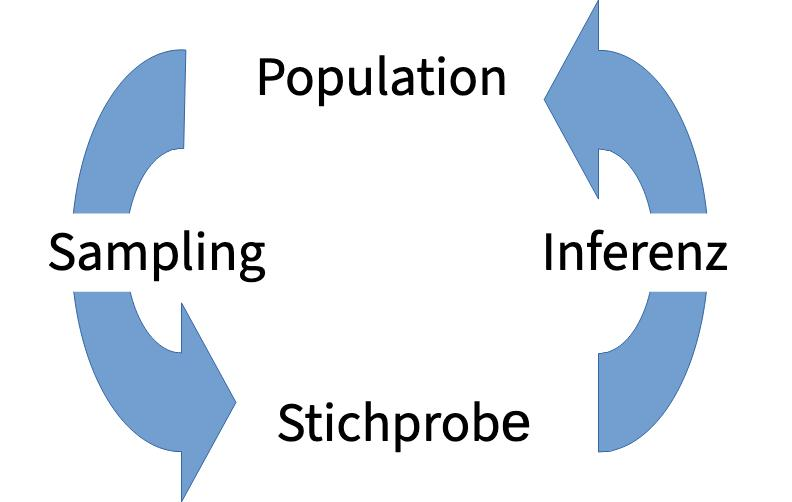

## Inhalte

- Zufallsvariable und Wahrscheinlichkeit
- Wahrscheinlichkeitsverteilung
- Bedeutung und Merkmale der Normalverteilung
- Standardnormalverteilung und Z-Transformation
- 68 – 95 – 99.7 – Regel
- Wahrscheinlichkeiten und Quantile der Normalverteilung
- Beurteilung der Normalverteilung von Variablen mit QQ-Plot

## 

::: {.callout-note}
## Zufallsvariable

- **Zufallsvariable**: Ergebnis eines Zufallsexperiments
- $X$: Bezeichnung der Zufallsvariablen
- $x$: Ein Ergebnis der Zufallsvariablen
:::

::: {.callout-tip}
## Beispiele 
| $X$                                             | $x$                   |
|-------------------------------------------------|-----------------------|
| Einen (fairen) Würfel werfen                    | Augenzahl = 5         |
| Körpergrösse einer zufällig ausgewählten Person | Körpergrösse = 169 cm |
| Gewicht eines zufällig ausgewählten M&M's       | Gewicht = 2.34 g      |

:::

::: {.notes}
- Zufallsvatiable: Grösse, deren Wert vom Zufall abhängig ist.
- Formal: Eine Funktion, die jedem Möglichen Ereignis eines Zufallsexperiments einen Wert zuordnet.
:::

## 
::: {.callout-note}
## Verteilung einer Zufallsvariablen

Wahrscheinlichkeit $P$ für ein bestimmtes Ergebnis $x$ von $X$:

$$
P(X = x)
$$
:::

::: {.callout-tip}
## Würfeln
|        Augenzahl        |       1       |       2       |       3       |       4       |       5       |       6       |
|:-----------------------:|:-------------:|:-------------:|:-------------:|:-------------:|:-------------:|:-------------:|
| $P(\textrm{Augenzahl})$ | $\frac{1}{6}$ | $\frac{1}{6}$ | $\frac{1}{6}$ | $\frac{1}{6}$ | $\frac{1}{6}$ | $\frac{1}{6}$ |

$$
P(1) = P(2) = P(3) = P(4) = P(5) = P(6) = \frac{1}{6}
$$

Die Augenzahl ist gleichverteilt (bei einem fairen Würfel).
:::

## Farben vom M&Ms {.smaller}

```{r}
#| echo: false

## -------------------------------------------------
## 0. Packages -------------------------------------------------
## -------------------------------------------------
library(tidyverse)   # readr, dplyr, tidyr, ggplot2
library(kableExtra)  # pretty tables
library(patchwork)
library(cowplot) # plot_grid
library(gridExtra) # to create subplots
library(readxl) # for importing Excel spreadsheets
library(car) # qqplot with confidence bounds
library(gamlss)
library(jmv) # jamovi library
library(moments) # to calculate skewness and kurtosis
library(pastecs) # descriptive statistics of data frame
library(data.table) # provides fread()
## -------------------------------------------------
## 1. Load the data -----------------------------------------
## -------------------------------------------------
df <- read_csv("../data/MMs.csv")
df$Farbe <- as_factor(df$Farbe)
df$ID <- as_factor(df$ID)

## -------------------------------------------------
## 2. Overall colour probabilities (no grouping) ----------
## -------------------------------------------------
prob_all <- df |>                     # keep only rows where a colour is recorded
  filter(!is.na(Farbe)) |>            
  count(Farbe, name = "n") |>         # how many times each colour occurs
  mutate(
    total    = sum(n),                 # total number of non‑NA colour observations
    prob     = n / total,              # P(colour)
    prob_not = 1 - prob                # complementary probability
  ) |>
  select(Farbe, n, prob, prob_not)

## -------------------------------------------------
## 3. Reshape for ggplot ------------------------------------
## -------------------------------------------------
prob_long <- prob_all |>
  pivot_longer(
    cols = c(prob, prob_not),
    names_to = "type",
    values_to = "value"
  ) |>
  mutate(
    type = factor(type,
                  ## levels = c("prob", "prob_not"),
                  ## labels = c("P(Farbe)", "1–P(Farbe)"))
                  levels = c("prob_not", "prob"),
                  labels = c("1–P(Farbe)", "P(Farbe)"))
  )
```

:::: {.columns}

::: {.column width="40%"}

```{r}
#| echo: false

# Show frequency/probability table
prob_tbl <- prob_all
# total number of valid rows
N_total <- sum(prob_all$n)

# Add a summary row (total count) 
summary_row <- tibble(
  Farbe = "Total",
  n     = N_total,
  prob     = round(sum(prob_all$prob), 5)   # should be exactly 1.00000
)
prob_tbl <- bind_rows(prob_tbl, summary_row)

prob_tbl |>
  select(-prob_not) |>
  mutate(
  # format digits of probabiltiy columns
  ## prob = ifelse(is.na(prob), "", sprintf("%.2f", prob)),
  ## prob_not = ifelse(is.na(prob_not), "", sprintf("%.2f", prob_not))) |>
  prob = ifelse(is.na(prob), "", sprintf("%.2f", prob))) |>
  kableExtra::kable(
              col.names = c("Farbe", "n", "P"))  %>% 
  row_spec(nrow(prob_tbl),               # style the TOTAL row
           bold = TRUE)
```

:::

::: {.column width="60%"}

```{r}
#| echo: false

# -------------------------------------------------
# Plot – stacked bar, y‑axis fixed to [0,1],
#    with the numeric probability shown on each segment
# -------------------------------------------------
pmmprob <- prob_long |>
  filter(Farbe %in% c("Rot", "Blau")) |>
  ggplot(aes(x = Farbe, y = value, fill = type)) +
  geom_col(width = 0.7) +                                 # stacked bars
  geom_text(aes(label = sprintf("%.2f", value)),          # three‑decimal label
            position = position_stack(vjust = 0.5),       # centre inside each segment
            size = 9,
            colour = "white") +                         # white works well on the fill colours
  ylim(0,1) +
  labs(
    ## title = "Wahrscheinlichkeit ein M&Ms einer bestimmten Farbe zu ziehen",
    x     = "Farbe",
    y     = "Probability",
    fill  = ""
  ) +
  theme(
    text = element_text(size = 20),
    axis.text.x   = element_text(angle = 45, hjust = 1),
    legend.position = "top"
  )
pmmprob
```

:::
::::

::: {.callout-note}
## Wir stellen fest

- Die relative Häufigkeit in der Stichprobe: Wahrscheinlichkeit ein M\&M's der Farbe zu ziehen.
- Diese Wahrscheinlichkeit ist nicht mehr gleichverteilt.
:::

## Augenzahlsumme Würfeln

```{r}
set.seed(100)
numrolls <- 1000 # 1000 Würfe
dicedf <- data.frame()
for (i in seq(1,numrolls,1)) {
  # single die
  diceroll <- sample(x = 1:6, size = 1, replace = TRUE)
  df <- data.frame(sum(diceroll),"1 Würfel")
  names(df) <- c("EyeSum","NumberOfDice")
  dicedf <- bind_rows(dicedf,df)
  # two dice
  diceroll <- sample(x = 1:6, size = 2, replace = TRUE)
  df <- data.frame(sum(diceroll),"2 Würfel")
  names(df) <- c("EyeSum","NumberOfDice")
  dicedf <- bind_rows(dicedf,df)
  # three dice
  diceroll <- sample(x = 1:6, size = 3, replace = TRUE)
  df <- data.frame(sum(diceroll),"3 Würfel")
  names(df) <- c("EyeSum","NumberOfDice")
  dicedf <- bind_rows(dicedf,df)
  # six dice
  diceroll <- sample(x = 1:6, size = 6, replace = TRUE)
  df <- data.frame(sum(diceroll),"6 Würfel")
  names(df) <- c("EyeSum","NumberOfDice")
  dicedf <- bind_rows(dicedf,df)
}
dicedf$NumberOfDice <- as_factor(dicedf$NumberOfDice)
```

```{r}
#| echo: false
imgpath <- "../images/dice3.png"
imgwidth <- 0.1
ypos <- 0.2
df <- filter(dicedf, NumberOfDice == "1 Würfel")
p1 <- ggplot(df, aes(x = EyeSum)) +
  geom_histogram(binwidth = 1) +
  scale_x_continuous(breaks = seq(1,12)) +
  labs(x = "Augenzahlsumme", y = "Häufigkeit")
p1i <- ggdraw() + draw_plot(p1) +
  draw_image(imgpath, x = 0.2, y = ypos, width = imgwidth)

df <- filter(dicedf, NumberOfDice == "2 Würfel")
p2 <- ggplot(df, aes(x = EyeSum)) +
  geom_histogram(binwidth = 1) +
  scale_x_continuous(breaks = seq(1,12)) +
  labs(x = "Augenzahlsumme", y = "Häufigkeit")
p2i <- ggdraw() + draw_plot(p2) +
  draw_image(imgpath, x = 0.2, y = ypos, width = imgwidth) +
  draw_image(imgpath, x = 0.3, y = ypos, width = imgwidth)

df <- filter(dicedf, NumberOfDice == "3 Würfel")
p3 <- ggplot(df, aes(x = EyeSum)) +
  geom_histogram(binwidth = 1) +
  scale_x_continuous(breaks = seq(1,18,2)) +
  labs(x = "Augenzahlsumme", y = "Häufigkeit")
p3i <- ggdraw() + draw_plot(p3) +
  draw_image(imgpath, x = 0.2, y = ypos, width = imgwidth) +
  draw_image(imgpath, x = 0.3, y = ypos, width = imgwidth) +
  draw_image(imgpath, x = 0.4, y = ypos, width = imgwidth)

df <- filter(dicedf, NumberOfDice == "6 Würfel")
p4 <- ggplot(df, aes(x = EyeSum)) +
  geom_histogram(binwidth = 1) +
  scale_x_continuous(breaks = seq(1,36,2)) +
  labs(x = "Augenzahlsumme", y = "Häufigkeit") 
p4i <- ggdraw() + draw_plot(p4) +
  draw_image(imgpath, x = 0.2, y = ypos, width = imgwidth) +
  draw_image(imgpath, x = 0.3, y = ypos, width = imgwidth) +
  draw_image(imgpath, x = 0.4, y = ypos, width = imgwidth) +
  draw_image(imgpath, x = 0.5, y = ypos, width = imgwidth) +
  draw_image(imgpath, x = 0.6, y = ypos, width = imgwidth) +
  draw_image(imgpath, x = 0.7, y = ypos, width = imgwidth)

(p1i | p2i) / (p3i | p4i) +
  plot_annotation(title = sprintf("Häufigkeiten von Augenzahlsummen bei %.0f Würfen", numrolls))
```

## Körpergewicht

```{r}
#| echo: false
#| fig.align: "center"
df <- read.csv("../data/NHANES-2015-2016.csv")
df$Geschlecht <- as_factor(df$Geschlecht)
dff <- df |> # Weibliche Personen
  filter(df$Geschlecht == "f") |>
  filter(!is.na(Koerpergroesse))

N <- 500 # number of observations to draw randomly
rows <- sample(1:nrow(dff), N)
dff <- dff[rows, ]
n <- nrow(dff)
mn <- mean(dff$Koerpergroesse)
sd <- sd(dff$Koerpergroesse)
binwidth <- 2.5
phist <- dff |>
  ggplot(mapping=aes(x=Koerpergroesse)) +
  geom_histogram(binwidth = binwidth, colour="black", fill="white") +
  stat_function(
    fun = function(x, mean, sd, n, bw){
      dnorm(x=x, mean=mean, sd=sd)*n*bw
    },
    args = c(mean = mn, sd = sd, n = n, bw = binwidth), colour="blue") +
  labs(x = "Körpergrösse (cm)",
       y = "Häufigkeit",
       title = sprintf(
         "Körpergrösse von Frauen (n = %.0f), Mean = %.1f cm, SD = %.1f cm",
         n, mn, sd)) +
  theme(text = element_text(size = 18))
phist
```

- Beschrieb von Verteilungen mittels **Dichte-**, **Verteilungs-** und **Quantilfunktion**

::: footer
[Datenquelle: NHANES 2015-2016 ](https://wwwn.cdc.gov/nchs/nhanes/continuousnhanes/overview.aspx?BeginYear=2015)
:::

## Dichte- und Verteilungsfunktion {.smaller}

:::: {.columns}

::: {.column width="50%"}

```{r}
#| echo: false
#| fig.align: "center"
phist <- dff |>
  ggplot(mapping=aes(x=Koerpergroesse)) +
  geom_histogram(aes(y = ..density..),
                 binwidth = binwidth,
                 colour="black", fill="white") +
  stat_function(
    fun = function(x, mean, sd, n, bw){
      dnorm(x=x, mean=mean, sd=sd)
    },
    args = c(mean = mn, sd = sd, n = n, bw = binwidth), colour="blue") +
  labs(x = "Körpergrösse (cm)",
       y = "Dichte",
       title = sprintf(
         "Körpergrösse von Frauen (n = %.0f), Mean = %.1f cm, SD = %.1f cm",
         n, mn, sd)) +
  theme(text = element_text(size = 18))
phist
```

Ein Histogramm schätzt die Dichtefunktion (auch Wahrscheinlichkeitsdichtefunktion/Eng. probability density function PDF) $f$ (blaue Kurve).
:::

::: {.column width="50%"}

```{r}
#| echo: false
#| fig.align: "center"
ggplot(dff, mapping=aes(x=Koerpergroesse)) + stat_ecdf(geom = "step") + 
  stat_function(fun=pnorm,color="blue",args=list(mean=mn,sd=sd))+
  labs(x = "Körpergrösse (cm)", y = "F(Körpergrösse)") +
  theme(text = element_text(size = 18))
```

Die empirische Verteilungsfunktion $F_n$ schätzt die Verteilungsfunktion (auch kumulative Verteilungsfunktion/Eng. cumulative distribution function CDF) $F$ (blaue Kurve).

:::
::::

## Dichte- und Verteilungsfunktion {.smaller}

```{r}
#| echo: false

# Dichte-, Verteilungs- und Quantilfunktionen der entsprechenden Normalverteilung manuell rechnen und plotten# Dichtefunktion rechnen
dens <- density(dff$Koerpergroesse)
# Verteilungsfunktion rechnen
distr <- ecdf(dff$Koerpergroesse)
perc <- distr(dff$Koerpergroesse)
# Quantilfunktion rechnen
p <- seq(0,1,0.05)
p <- seq(0,1,1/(length(dff$Koerpergroesse)-1))
quant <- quantile(distr, probs = p)
grid <- seq(min(dff$Koerpergroesse),max(dff$Koerpergroesse),length=length(quant))
normaldens <- dnorm(grid,mn,sd)
normaldistr <- pnorm(grid,mn,sd)
normalquant <- qnorm(normaldistr,mn,sd)
```

:::: {.columns}

::: {.column width="50%"}

```{r}
#| echo: false
#| fig.align: "center"
normaldf <- data.frame(grid,normaldens,normaldistr)
ggplot(normaldf,aes(x=grid,y=normaldens)) +
  geom_area(aes(x=ifelse(grid<165, grid, NA)), fill="blue") +
  geom_line(color="black", size=2) +
  labs(x="Körpergrösse (cm)", y="Dichte") +
  theme(text = element_text(size = 18))
```
:::

::: {.column width="50%"}

```{r}
#| echo: false
#| fig.align: "center"

pdensgroesse <- ggplot(normaldf,aes(x=grid,y=normaldistr)) +
  geom_line(color="black", size=2) +
  geom_segment(
    x=165,
    xend=165,
    y=0,
    yend=mean(normaldistr[round(grid)==165]),
    color="blue",size=1) +
  geom_segment(
    x=min(grid),
    xend=165,
    y=mean(normaldistr[round(grid)==165]),
    yend=mean(normaldistr[round(grid)==165]),
    color="blue",size=1) +
  geom_point(
    x=165,
    y=mean(normaldistr[round(grid)==165]),
    color="blue", size=10) +
  labs(x="Körpergrösse (cm)", y="F(Körpergrösse)") +
  theme(text = element_text(size = 18))
pdensgroesse
```

:::
::::

Bedeutung der Verteilungsfunktion der Variable $X$
$$
F(x)=P(X \leq x)
$$

::: {.callout-tip}
## Beispiel
- Wenn $X$ die Körpergrösse ist, ist $F(165)$ die Wahrscheinlichkeit, dass eine zufällig ausgewählte Person kleiner oder gleich 165 cm gross ist.
- Die Verteilungsfunktion an der Stelle $x$ ist die Fläche unter der Dichtefunktion bis zu Stelle $x$.
:::

## Normalverteilung {.smaller}

- Die Normalverteilung hat die zwei Parameter $\mu$ (Mittelwert) und $\sigma$ (Standardabweichung).
- Der Spezialfall mit $\mu = 0$ und $\sigma = 1$ führt zur Standard-Normalverteilung.

```{r}
#| echo: false
#| fig.align: "center"
#| out.width: "80%"
# Make a sequence of z-scores between -3 and 3 with a spacing of 0.1
z_scores <- seq(-3,3,.01)

# Probability density function
dens <- dnorm(z_scores)

zdensdf <- data.frame(z_scores,dens)
pdens <- zdensdf |>
  ggplot(aes(z_scores,dens)) +
  geom_line(size=2) +
  labs(
    title = "Dichtefunktion der Standard-Normalverteilung",
    y="Dichte",
    x="z-Wert") +
  xlim(-3,3) +
  theme(text = element_text(size = 20))

# Distribution function
distr <- pnorm(z_scores)
zdistrdf <- data.frame(z_scores,distr)

pdistr <- zdistrdf |>
  ggplot(aes(z_scores,distr)) +
  geom_line(size=2) +
  ggtitle("Verteilungsfunktion der Standard-Normalverteilung") +
  labs(title = "Verteilungsfunktion der Standard-Normalverteilung",
       y="",
       x="z-Wert") +
  xlim(-3,3) +
  theme(text = element_text(size = 20))

# Quantiles
probability <- seq(0,1,0.001)
quant <- qnorm(probability)
zquantdf <- data.frame(probability,quant)
pquant <- zquantdf |>
  ggplot(aes(probability,quant)) +
  geom_line(size=2) +
  labs(title = "Quantilfunktion der Standard-Normalverteilung") +
  theme(text = element_text(size = 20))
```

:::: {.columns}

::: {.column width="50%"}

```{r}
#| echo: false
#| fig.align: "center"
#| out.width: "80%"
phist
```
:::

::: {.column width="50%"}

```{r}
#| echo: false
#| fig.align: "center"
#| out.width: "80%"

pdens
```

:::
::::

::: {.callout-tip}
## z-Transformation: Umrechnung in Standard-Normalverteilung
$$
z_n = \frac{x_n - \bar{x}}{s}
$$
:::

::: {.notes}
Die Normalverteilung, auch Gaussverteilung oder Gausssche Glocke genannt, spielt eine sehr wichtige Rolle in der Wahrscheinlichkeitstheorie und Statistik:

- Mittelwerte von genügend vielen unabhängigen Zufallsexperimenten sind annäherungsweise normalverteilt (nach dem sogenannten zentralen Grenzwertsatz).
- Zufällige Messfehler sind bei einigen Versuchen (z.B. physikalische Laborversuche) annäherungsweise normalverteilt.
- Einige quantitative Merkmale sind normalverteilt (z.B. Körpergrösse nach Geschlecht).
- Für normalverteilte Variablen gelten besonders einfache mathematische Sätze.

Aus diesen Gründen gibt es viele Tests und Schätzer, die die Normalverteilung als Voraussetzung haben.
:::

## Anmerkungen zur Notation {.smaller}

::: {.center}
|                    |          |
|--------------------|----------|
| Mittelwert         | $\mu$    |
| Standardabweichung | $\sigma$ |
|                    |          |
:::

{fig-align="center" height=50mm}

::: {.center}
|                    |                                          |
|--------------------|------------------------------------------|
| Mittelwert         | $\hat{\mu} = \bar{x}$                    |
| Standardabweichung | $\hat{\sigma} = s$ (oft auch sd oder SD) |
:::

::: {.notes}
- Populationskennzahlen (auch Stichprobenparameter): griechische Buchstaben
- Stichprobenkennzahlen: lateinische Buchstaben
:::

## z-Werte und Standardisierung {.smaller}

- Anna und Tom möchten in den USA studieren. Dazu müssen Sie einen Aufnahmeverfahren durchlaufen, das u.a. Tests zu Mathe, Lesen und kreativem Schreiben umfasst. Es gibt davon zwei Varianten: den SAT (Scholastic Assessment Test) und den ACT (American College Test).
- Anna hat 1800 Punkte im SAT erreicht, Tom hat den ACT absolviert und 24 Punkte erreicht.
- Die Gesamtscores beider Tests sind normalverteilt mit den Kennzahlen

|                    | SAT  | ACT |
|--------------------|:----:|:---:|
| Mittelwert         | 1500 | 21  |
| Standardabweichung | 300  |  5  |

<!-- **Wer von beiden hat das bessere Resultat erzielt?** -->

::: {.callout-note}
## Frage

Wer von beiden hat das bessere Resultat erzielt?
:::

## z-Werte und Standardisierung {.smaller}

:::: {.columns}

::: {.column width="33%"}

$$
z_n = \frac{x_n - \bar{x}}{s}
$$


:::

::: {.column width="33%"}

$$
z_{\mathrm{Anna}} = \frac{1800-1500}{300} = 1
$$

:::
::: {.column width="33%"}


$$
z_{\mathrm{Tom}} = \frac{24-21}{5} = 0.6
$$
:::
::::

```{r}
#| echo: false
#| fig.align: "center"
#| out.width: "40%"
SATm <- 1500
SATs <- 300
SATanna <- 1800
zanna <- (SATanna - SATm)/SATs
ACTm <- 21
ACTs <- 5
ACTtom <- 24
zanna <- (SATanna - SATm)/SATs
ztom <- (ACTtom - ACTm)/ACTs

SATgrid <- seq(SATm - 1000, SATm + 1000, 1)
SATdens <- dnorm(SATgrid,SATm,SATs)
SATdf <- data.frame(SATgrid,SATdens)
pSAT <- ggplot(SATdf,aes(x=SATgrid,y=SATdens)) +
  geom_line(color="black", size=2) +
  geom_vline(xintercept = SATanna, size = 2,
             colour = "blue") +
  geom_vline(xintercept = SATm, size = 2,
             linetype = "dashed") +
  labs(title = "Anna", x="SAT", y = "") +
  theme(text = element_text(size = 24),
        axis.text.y = element_blank(),
        axis.ticks.y = element_blank())
ACTgrid <- seq(ACTm - 15, ACTm + 15, 1)
ACTdens <- dnorm(ACTgrid,ACTm,ACTs)
ACTdf <- data.frame(ACTgrid,ACTdens)
pACT <- ggplot(ACTdf,aes(x=ACTgrid,y=ACTdens)) +
  geom_line(color="black", size=2) +
  geom_vline(xintercept = ACTtom, size = 2,
             colour = "orange") +
  geom_vline(xintercept = ACTm, size = 2,
             linetype = "dashed") +
  labs(title = "Tom", x="ACT", y = "") +
  theme(text = element_text(size = 24),
        axis.text.y = element_blank(),
        axis.ticks.y = element_blank())

pz <- pdens +
  labs(title = "", y = "", x = "z") +
  geom_vline(xintercept = zanna, size = 2,
             colour = "blue") +
  geom_vline(xintercept = ztom, size = 2,
             colour = "orange") +
  geom_vline(xintercept = 0, size = 2,
             linetype = "dashed")+
  theme(text = element_text(size = 24),
        axis.text.y = element_blank(),
        axis.ticks.y = element_blank())

(pSAT / pACT) | pz
```

::: {.callout-note}
## Wir stellen fest

- Anna liegt mit ihrem Score eine Standardabweichung über dem mittleren SAT Score.
- Tom liegt mit seinem Score 0.6 Standardabweichungen über dem mittleren ACT Score.
- Anna hat also besser abgeschnitten: ihr Score liegt relativ gesehen weiter oberhalb des mittleren Scores.
:::

## Flächen unter der Normalverteilung {.smaller}

```{r}
#| echo: false
#| fig.align: "center"
#| out.width: "80%"
(pSAT / pACT) | pz
```

::: {.callout-note}
## Frage

- Auf welcher Perzentile unter allen Teilnehmenden am SAT/ACT-Test liegen Anna und Tom?
- Oder: Wie viele Teilnehmende haben schlechter (oder besser) als sie abgeschlossen?
:::

- Mit Hilfe des z-Werts können wir diese Frage beantworten.
- Gesamtfläche unter Normalverteilungskurve ist immer 1 (100% der Beobachtungen).
- Flächenanteile unter der Kurve entsprechen Häufigkeiten.

## Flächen unter der Normalverteilung {.smaller}

:::: {.columns}

::: {.column width="50%"}
```{r}
#| echo: false
#| fig.align: "center"
#| out.width: "100%"
panna <- pdens +
  labs(title = "Anna", y = "", x = "z") +
  geom_area(aes(x=ifelse(z_scores < zanna, z_scores, NA)), fill="blue") +
  annotate(
    "label",
    x = 0, y = 0.5*max(zdensdf$dens), label = sprintf("%.0f%%",round(pnorm(zanna,0,1), digits = 2)*100),
    angle = 0, colour = "steelblue", fill = "white", size = 12
  ) +
  theme(
    text = element_text(size = 24),
    axis.text.y = element_blank(),
    axis.ticks.y = element_blank()
  )
ptom <- pdens +
  labs(title = "Tom", y = "", x = "z") +
  geom_area(aes(x=ifelse(z_scores < ztom, z_scores, NA)), fill="orange") +
  annotate(
    "label",
    x = 0, y = 0.5*max(zdensdf$dens), label = sprintf("%.0f%%",round(pnorm(ztom,0,1), digits = 2)*100),
    angle = 0, colour = "steelblue", fill = "white", size = 12
  ) +
  theme(text = element_text(size = 24),
        axis.text.y = element_blank(),
        axis.ticks.y = element_blank())
# panna
# ptom
panna / ptom
```

::: {.callout-note}
## Wir stellen fest

- 84% der Teilnehmenden im SAT Test haben schlechter abgeschnitten als Anna (16% waren besser).
- 73% der Teilnehmenden im ACT Test haben schlechter abgeschnitten als Tom (27% waren besser).
:::
:::

::: {.column width="50%"}

```{r}
# -------------------------------------------------
# R script: z‑table → HTML (text‑book style)
# -------------------------------------------------

# Column headers are the second decimal place of z
cols <- sprintf("%0.2f", seq(0, 0.09, by = 0.01))
  
# Row headers are the first decimal place of z
rows <- sprintf("%0.1f", seq(0, 2, by = 0.1))
  
# Allocate matrix
tbl <- matrix(NA, nrow = length(rows), ncol = length(cols),
                dimnames = list(rows, cols))
  
# Fill with cumulative probabilities Φ(z)
for (r in seq_along(rows)) {
  for (c in seq_along(cols)) {
    z <- as.numeric(rows[r]) + as.numeric(cols[c])
      # Φ(z) = P(Z ≤ z) for standard normal
      tbl[r, c] <- sprintf("%0.3f", pnorm(z))
    }
  }
# 4. Convert to a data frame for knitr (adds row names as a column)
z_df <- data.frame(z = rownames(tbl), tbl, stringsAsFactors = FALSE)

# Use knitr's kable() with the "html" format.
z_df |>
  kable(
    format = "html",
    caption = "Kumulative Warscheinlichkeiten der Standard-Normalverteilung",
    col.names = c("z",".00",".01",".02",".03",".04",".05",".06",".07",".08",".09"),
    align = "c",
    row.names = FALSE
  ) |>
  kable_styling(font_size = 13)
```
:::
::::

## 68 - 95 - 99.7 Regel {.smaller}

:::: {.columns}

::: {.column width="70%"}


```{r}
#| echo: false
#| fig.align: "center"
#| out.width: "80%"

pregel <- ggplot(data.frame(x = c(-4, 4)), aes(x)) +
  stat_function(fun = dnorm,
                geom = "line",
                xlim = c(-4, 4)) +
  stat_function(fun = dnorm,
                geom = "area",
                fill = "steelblue",
                alpha = .2,
                xlim = c(-3, 3)) +
  stat_function(fun = dnorm,
                geom = "area",
                fill = "steelblue",
                alpha = .5,
                xlim = c(-2, 2)) +
  stat_function(fun = dnorm,
                geom = "area",
                fill = "steelblue",
                alpha = 1,
                xlim = c(-1, 1)) +
  stat_function(fun = dnorm,
                geom = "line",
                xlim = c(-4, 4)) +
  xlim(-4, 4) +
  theme_grey() +
  xlab("") +
  ylab("") +
  scale_x_continuous(breaks = c(-3, -2, -1, 0, 1, 2, 3),
                     labels = expression(mu - 3 * sigma,
                     mu - 2 * sigma,
                     mu - sigma,
                     mu,
                     mu + sigma,
                     mu + 2 * sigma,
                     mu + 3 * sigma)) +
  theme(axis.text.y = element_blank(),
        axis.ticks.y = element_blank(),
        text = element_text(size = 24))

pregel <- pregel + 
  annotate("segment", x = -1, xend = 1, y = .13, yend = .13,
           arrow = arrow(ends = "both", angle = 90)) +
  annotate("segment", x = -2, xend = 2, y = .08, yend = .08,
           arrow = arrow(ends = "both", angle = 90)) +
  annotate("segment", x = -3, xend = 3, y = .03, yend = .03,
           arrow = arrow(ends = "both", angle = 90)) +
  annotate("text", x = 0, y = .05, label = "99.7%", size = 8) +
  annotate("text", x = 0, y = .1, label = "95%", size = 8) +
  annotate("text", x = 0, y = .15, label = "68%", size = 8)
pregel
```

:::

::: {.column width="30%"}


| Bereich              | Fläche |
|----------------------|--------|
| $\mu\pm 1 \sigma$    | 68.3%  |
| $\mu\pm 1.96 \sigma$ | 95.0%  |
| $\mu\pm 2 \sigma$    | 95.5%  |
| $\mu\pm 3 \sigma$    | 99.7%  |

:::
::::


::: {.callout-tip}
## Merke

- Alle Normalverteilungen sind symmetrisch.
- Median und Mittelwert sind identisch.
- Eine Hälfte der Werte liegt unter und eine Hälfte über dem Mittelwert.
- Die 68-95-99.7 Regel erlaubt es, den Anteil der Werte innerhalb einer bestimmten Distanz vom Mittelwert zu bestimmen.
:::

## Prüfen auf Normalverteilung {.smaller}


:::: {.columns}

::: {.column width="50%"}
- Voraussetzung vieler statistischer Verfahren: Daten sind in der Population normalverteilt.
- Man schätzt die Verteilung anhand der Stichprobe ab.
- QQ-Plot: Quantile der theoretischen Normalverteilung (x-Achse) vs. Quantile der Stichprobe (y-Achse).
- **Quantile ungefähr auf einer Geraden**: Stichprobe stammt aus einer Normalverteilung.
:::

::: {.column width="50%"}

```{r}
#| echo: false
#| fig.align: "center"
#| fig-width: 5
#| fig-height: 8
#| out.width: "60%"
set.seed(10)
## n <- 500 # Number of samples to draw from distribution
## binwidth <- 0.3

n<-1000 # Number of samples to draw from distribution
binwidth <- 0.1

########## Samples from an exponential distribution ###########
# z.B. Beantwortung der Frage nach der Dauer von zufälligen Zeitintervallen
# (Zeit zwischen Anrufen, Lebensdauer von Atomen beim radioaktiven Zerfall,
# Lebensdauer von Bautteilen)
expsamples <- rexp(n, rate = 2)
# hist(expsamples)

########## Samples from a left skewed beta distribution ##########
p <- 5
q <- 2
betasamples <- rbeta(n, p, q)
# hist(betasamples)

######### Samples from a uniform distribution ###########
unisamples <- runif(n, min = 0, max = 1)
# hist(unisamples)

######### Samples from a binomial distribution ##########
binsamples <- rbinom(n, 10, 0.1)

####### Samples from a normal distribution ########
mn <- 0
sd <- 1
# normsamples <- rnorm(n,mean=mn,sd=sd)
# The rSHASH function from the GAMLSS package lets us to
# draw samples from skewed and arced normal distibutions.
normsamples <- rSHASHo(n, mu = mn, sigma = sd, nu = 0, tau = 1)

######### Skewed normal ##########
negskewsamples <- rSHASHo(n, mu = mn, sigma = sd, nu = -0.5, tau = 1)
posskewsamples <- rSHASHo(n, mu = mn, sigma = sd, nu = 0.5, tau = 1)

######### Kurtosis normal ##########
negkurtsamples <- rSHASHo(n, mu = mn, sigma = sd, nu = 0, tau = 1.2)
poskurtsamples <- rSHASHo(n, mu = mn, sigma = sd, nu = 0, tau = 0.8)

###### Put all in a data frame ######
distrdf <- data.frame(
    normsamples,
    expsamples,
    betasamples,
    unisamples,
    binsamples,
    posskewsamples,
    negskewsamples,
    poskurtsamples,
    negkurtsamples
)

xmin <- -4
xmax <- 4
fsize <- 15

mean_norm <- mean(normsamples)
median_norm <- median(normsamples)
mean_posskew <- mean(posskewsamples)
median_posskew <- median(posskewsamples)
mean_negskew <- mean(negskewsamples)
median_negskew <- median(negskewsamples)
############################# Histogram Normalverteilung ##################################
plt_norm_hist_nolabels <- ggplot(distrdf, aes(x = normsamples)) +
    # geom_histogram(binwidth = binwidth, colour="black", fill="white") +
    geom_histogram(aes(y = ..density..), binwidth = binwidth, colour = "black", fill = "white") +
    ## geom_density(colour="blue") +
    stat_function(
      fun = function(x, mean, sd) {
        dnorm(x=x, mean=mean, sd=sd)}, args = c(mean = mn, sd = sd), colour="blue") +
    ## geom_vline(xintercept = mean_norm, color = "gray40", linewidth = 1) +
    ## geom_vline(xintercept = median_norm, color = "gray40", linewidth = 1, linetype = "dashed") +
    labs(x = "", y = "", title = "Normalverteilung") +
  theme(text = element_text(size = fsize),
        axis.text.y = element_blank(),
        axis.ticks.y = element_blank()) +
  xlim(xmin, xmax)

############################# QQ-Plot Normalverteilung ##################################
plt_norm_qq_nolabels <- ggplot(distrdf, aes(sample=normsamples)) + stat_qq() +
  stat_qq_line() +
  labs(x = "", y = "") +
  theme(text = element_text(size = fsize))

############################# Boxplot Normalverteilung ##################################
plt_norm_bp_nolabels <- ggplot(distrdf, aes(x=normsamples)) +
  geom_boxplot() +
  labs(title = "", x = "", y = "") +
  theme(text = element_text(size = fsize),
        axis.text.y = element_blank(),
        axis.ticks.y = element_blank()) +
  xlim(xmin,xmax)

############################# Histogram Rechtsschief ##################################
plt_skewedpos_hist_nolabels <- ggplot(distrdf, aes(x = posskewsamples)) +
    # geom_histogram(binwidth = binwidth, colour="black", fill="white") +
  geom_histogram(aes(y = ..density..), binwidth = binwidth, colour = "black", fill = "white") +
    # geom_density(colour="blue") +
  stat_function(
    fun = function(x, mean, sd) {
      dnorm(x=x, mean=mean, sd=sd)
    },
    args = c(mean = mn, sd = sd), colour="blue") +
    ## geom_vline(xintercept = mean_posskew, color = "gray40", linewidth = 1) +
    ## geom_vline(xintercept = median_posskew, color = "gray40", linewidth = 1, linetype = "dashed") +
  labs(x = "", y = "", title = "Rechtsschief") +
  theme(text = element_text(size = fsize),
        axis.text.y = element_blank(),
        axis.ticks.y = element_blank()) +
  xlim(xmin, xmax)

############################# QQ-Plot Rechtsschief ##################################
plt_skewedpos_qq_nolabels <- ggplot(distrdf, aes(sample=posskewsamples)) + stat_qq() +
  stat_qq_line() +
  labs(x = "", y = "") +
  theme(text = element_text(size = fsize))
############################# Boxplot Rechtsschief ##################################
plt_skewedpos_bp_nolabels <- ggplot(distrdf, aes(x=posskewsamples)) +
  geom_boxplot() +
  labs(title = "", x = "", y = "") +
  theme(text = element_text(size = fsize),
        axis.text.y = element_blank(),
        axis.ticks.y = element_blank()) +
  xlim(xmin,xmax)

############################# Histogram Rechtsschief ##################################
plt_kurtneg_hist_nolabels <- ggplot(distrdf, aes(x = negkurtsamples)) +
    # geom_histogram(binwidth = binwidth, colour="black", fill="white") +
  geom_histogram(aes(y = ..density..), binwidth = binwidth, colour = "black", fill = "white") +
    # geom_density(colour="blue") +
  stat_function(
    fun = function(x, mean, sd) {
      dnorm(x=x, mean=mean, sd=sd)
    },
    args = c(mean = mn, sd = sd), colour="blue") +
    ## geom_vline(xintercept = mean_posskew, color = "gray40", linewidth = 1) +
    ## geom_vline(xintercept = median_posskew, color = "gray40", linewidth = 1, linetype = "dashed") +
  labs(x = "", y = "", title = "Flachgipflig") +
  theme(text = element_text(size = fsize),
        axis.text.y = element_blank(),
        axis.ticks.y = element_blank()) +
  xlim(xmin, xmax)

############################# QQ-Plot Rechtsschief ##################################
plt_kurtneg_qq_nolabels <- ggplot(distrdf, aes(sample=negkurtsamples)) + stat_qq() +
  stat_qq_line() +
  labs(x = "", y = "") +
  theme(text = element_text(size = fsize))
############################# Boxplot Rechtsschief ##################################
plt_kurtneg_bp_nolabels <- ggplot(distrdf, aes(x=negkurtsamples)) +
  geom_boxplot() +
  labs(title = "", x = "", y = "") +
  theme(text = element_text(size = fsize),
        axis.text.y = element_blank(),
        axis.ticks.y = element_blank()) +
  xlim(xmin,xmax)

plt_norm_hist_nolabels /
  plt_norm_bp_nolabels /
  plt_norm_qq_nolabels
```
:::
::::

::: {.notes}
Die Normalverteilung spielt eine sehr wichtige Rolle in der Wahrscheinlichkeitstheorie und Statistik:

- Mittelwerte von genügend vielen unabhängigen Zufallsexperimenten sind annäherungsweise normalverteilt (nach dem sogenannten zentralen Grenzwertsatz).
- Zufällige Messfehler sind bei einigen Versuchen (z.B. physikalische Laborversuche) annäherungsweise normalverteilt.
- Einige quantitative Merkmale sind normalverteilt (z.B. Körpergrösse nach Geschlecht).
- Für normalverteilte Variablen gelten besonders einfache mathematische Sätze.
- Aus diesen Gründen gibt es viele Tests und Schätzer, welche die Normalverteilung als Voraussetzung haben.
:::

## QQ-Plot: Beispiele


```{r}
#| echo: false
#| fig.align: "center"
#| fig-width: 10
#| fig-height: 8
#| out.width: "100%"

(plt_norm_hist_nolabels | plt_skewedpos_hist_nolabels | plt_kurtneg_hist_nolabels) /
  (plt_norm_bp_nolabels | plt_skewedpos_bp_nolabels | plt_kurtneg_bp_nolabels)/
  (plt_norm_qq_nolabels | plt_skewedpos_qq_nolabels | plt_kurtneg_qq_nolabels)

```

## Zusammenfassung {.smaller}

:::: {.columns}

::: {.column width="70%"}

- Zufallsexperiment: z.B. Würfeln mit der Zufallsvariablen $X$, deren Ergebnis (Augenzahl) gleichverteilt ist.
- Merkmale sind oft nicht gleichverteilt: Histogramm zur Beurteilung der Verteilung.
- Normalverteilung spielt eine zentrale Rolle, weil viele Merkmale einer Normalverteilung folgen.
- Flächen der Wahrscheinlichkeitsdichte: Wahrscheinlichkeit und Häufigkeit von Ergebnissen.
- Standardiesierung (z-Transformation): Vergleich von Wahrscheinlichkeiten unterschiedlicher Skalen.
- Normalverteilung als Grundvoraussetzung für viele statistische Tests und Schätzer: wird mittels QQ-Plot geprüft.

:::

::: {.column width="30%"}

```{r}
#| echo: false
#| fig.align: "center"
#| fig-height: 20
#| out.width: "100%"

pmmprob /
plt_norm_hist_nolabels /
panna / ptom /
pregel /
plt_norm_qq_nolabels

```
:::
::::
