## Über Patric {.smaller}

:::: {.columns}

::: {.column width="50%"}
- Polymechaniker und Ingenieur Mikrotechnik
- MSc/PhD Biomedical Engineering UniBE
- Leiter Bern Movement Lab
- Passionierter Velofahrer

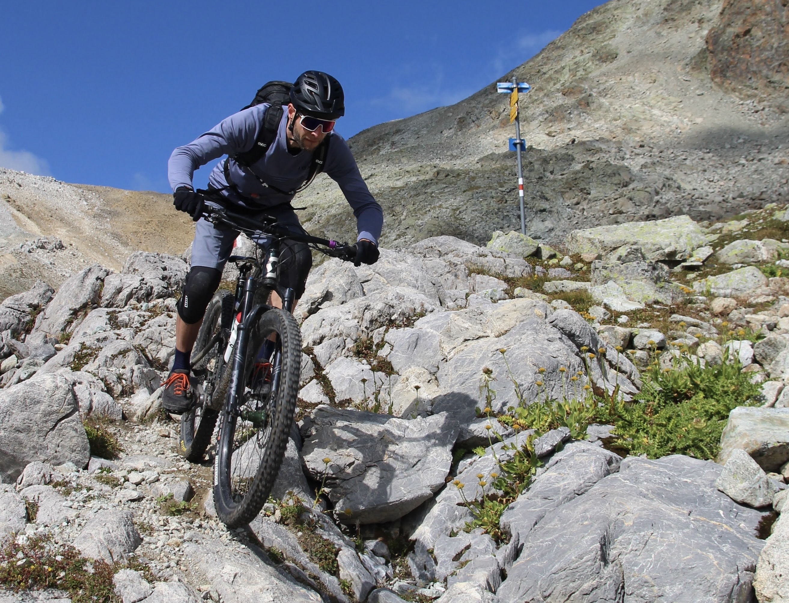{fig-align="center" width=80%}
:::

::: {.column width="50%"}

- Technologieanwendung in Physiotherapie und Orthopädietechnik
- Bewegungsbiomechanik und Datenanalyse
- Offene Wissenschaften und digitale Souveränität

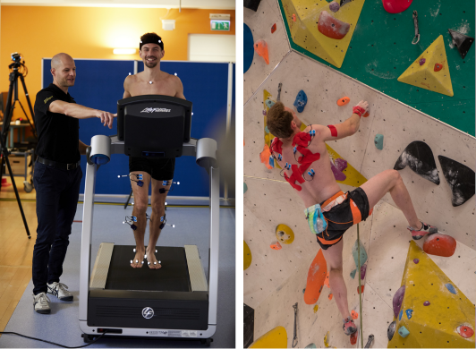{fig-align="center" width=80%}
:::

::::

::: footer
Learn more: [Foot Biomechanics and Technology Research Group](https://www.bfh.ch/en/research/research-areas/foot-biomechanics-and-technology/)
:::

## Über Aglaja {.smaller}

:::: {.columns}

::: {.column width="50%"}

- BA angewandte Sportwissenschaften
- PhD Clinical Exercise Science
- Canoe Polo Enthusiast

{fig-align="center" width=80%}
:::

::: {.column width="50%"}

- PhD: Cotrical and Neuromuscular Activity after ACL Rupture
- Injury and Illness Surveillance in Para athletes

::: {layout-ncol=2}

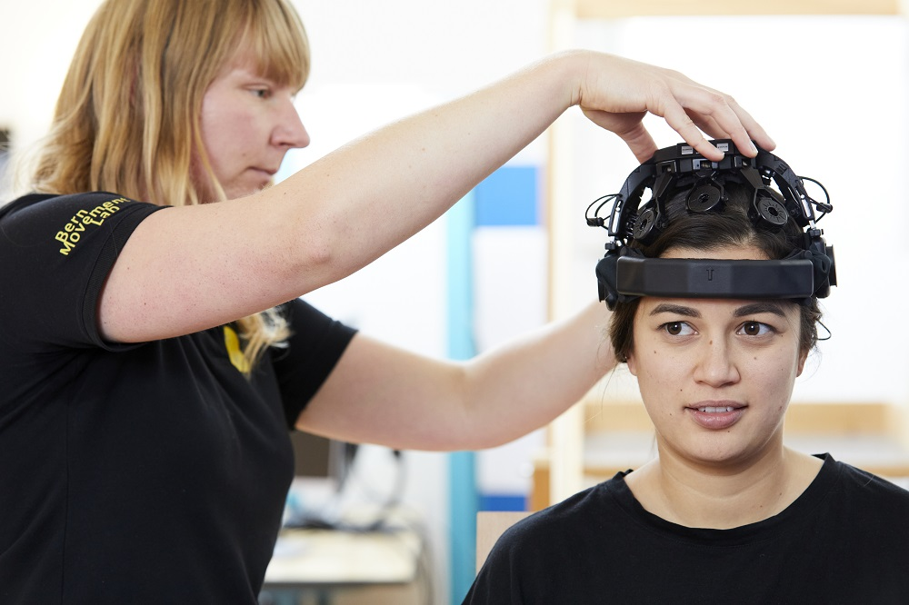{width=80%}

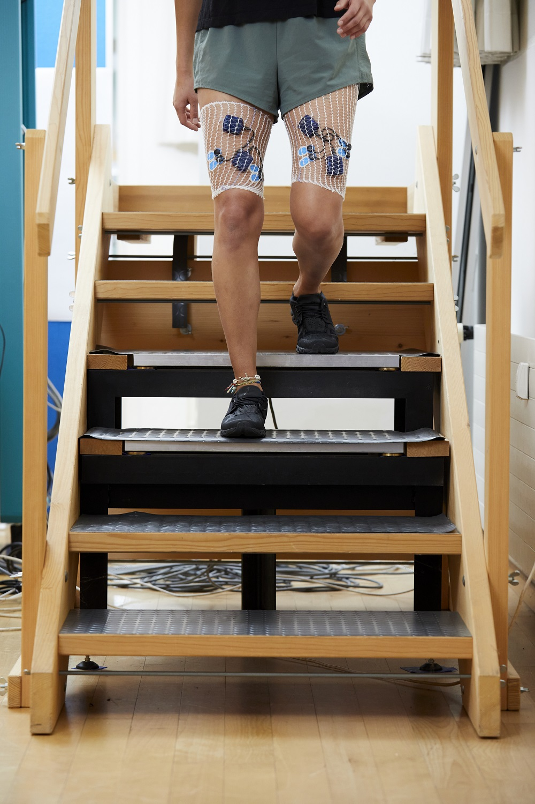{width=80%}

:::

:::

::::

::: footer
Learn more: [BFH Aglaja Busch](https://www.bfh.ch/de/ueber-die-bfh/personen/2rtqordmzaqr/)
:::

## Über Melanie {.smaller}

:::: {.columns}

::: {.column width="50%"}
- Sports physiotherapist (BSc, MSc, cand. PhD)
- Pilates instructor
- Coffee nerd and sports lover

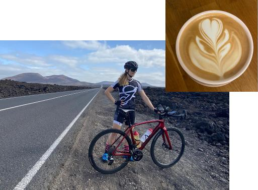{fig-align="center" width=80%}
:::

::: {.column width="50%"}

- Chronic non-specific low back pain and overweight - influence of lifestyle factors and beliefs
- Body composition changes during one menstrual cycle in healthy females

{fig-align="center" width=80%}

:::

::::

::: footer
Learn more: [BFH Melanie Liechti](https://www.bfh.ch/de/ueber-die-bfh/personen/jnbqzwmzp5kl/)
:::

## Studien verstehen

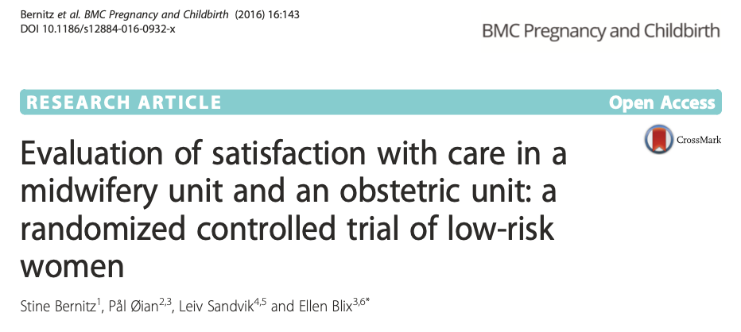{fig-align="center" width=50%}

:::: {.columns}

::: {.column width="33%"}

Ziele

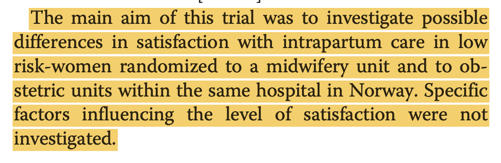{width=100% .lightbox}
:::

::: {.column width="33%"}

Einschlusskriterien

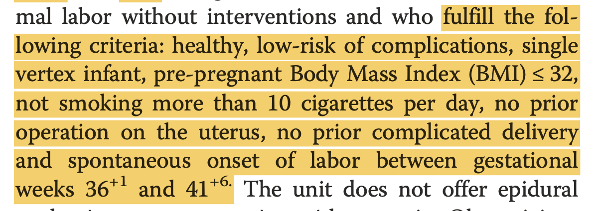{width=100% .lightbox}

:::

::: {.column width="33%"}

Messgrösse

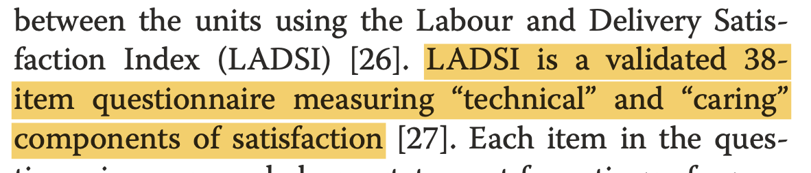{width=100% .lightbox}

:::
::::

<!-- ::: {#fig-bernitz layout-ncol=3 layout-valign="center"} -->

<!-- {fig-align="center" width=100% .lightbox} -->

<!-- {fig-align="center" width=100% .lightbox} -->

<!-- {fig-align="center" width=100% .lightbox} -->

<!-- Studien verstehen -->

<!-- ::: -->

::: footer
 [Bernitz et al., 2016, BMC Pregnancy and Childbirth](https://doi.org/10.1186/s12884-016-0932-x)
:::

## Studien verstehen (cont.)

<!-- ::: {layout="[30,70]" layout-valign="center"} -->

<!-- 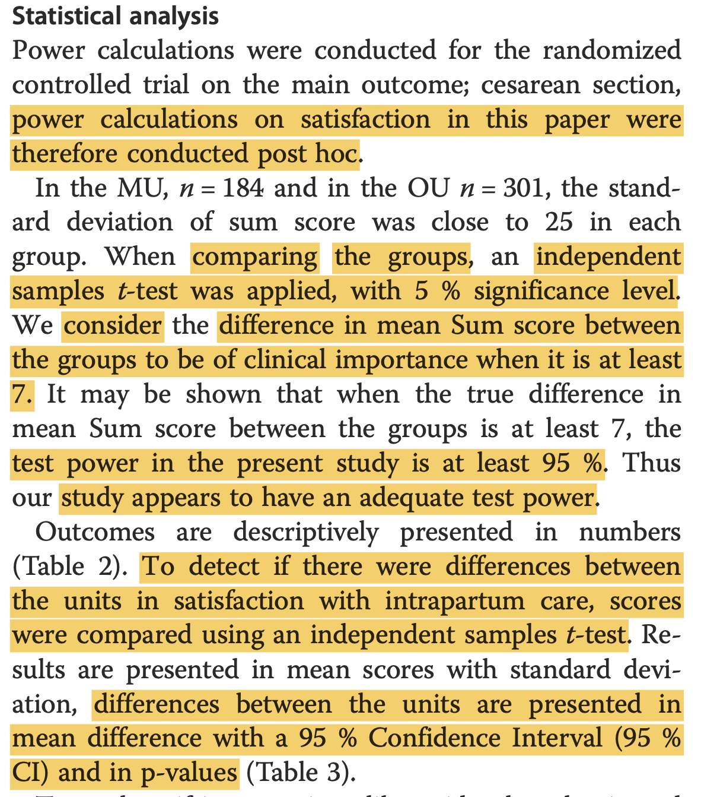{fig-align="center" width=100% .lightbox} -->

<!-- 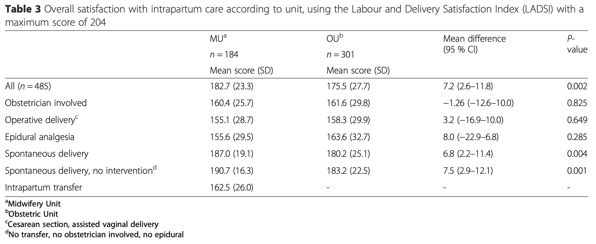{fig-align="center" width=100% .lightbox} -->

<!-- ::: -->

:::: {.columns}

::: {.column width="30%"}

Statistik

{width=100% .lightbox}
:::

::: {.column width="70%"}

Resultate

{width=100% .lightbox}

:::
::::

::: footer
 [Bernitz et al., 2016, BMC Pregnancy and Childbirth](https://doi.org/10.1186/s12884-016-0932-x)
:::

## Kursinhalt {.smaller}

- Kursinformation und Einführung Statistiksoftware
- LE1 - Deskriptive Statistik
  - Wie können wir in der Praxis Daten nummerisch und grafisch beschreiben?
- LE2 - Verteilungen von Wahrscheinlichkeiten
  - Vom Umgang mit Wahrscheinlichkeiten - Normalverteilung als zentrales Konzept
- LE3 - Grundlagen Inferenzstatistik
  - Wie können wir wahre Gegebenheiten anhand einer Stichprobe schätzen?

## Kursinhalt (cont.) {.smaller}

- LE4 - Vergleich von Mittelwerten
  - Ist eine beobachtete Differenz nur Zufall?
- LE5 - Korrelation und Regression
  - Wie hängen Messgrössen zusammen? Wie ist z.B. die Schrittlänge abhängig von der Körpergrösse?
- LE6 - Analyse von kategoriellen Daten
  - Wie testet man ob sich Häufigkeiten statistisch unterscheiden?

## Konzept und Kompetenznachweis {.smaller}

- Theorie als Vorlesungen in Form von Screencasts.
- Starker Fokus auf Übungen in Form von Workshops als Präsenzveranstaltungen.
- Wir starten heute mit einer Erhebung von eigenen Daten, welche dann im weiteren Kursverlauf verwendet werden.

**Kompetenznachweis**

::: {.callout-important}

- Closed Book Testfragenprüfung über Moodle
- Zeit: 90 Minuten
- Erlaubt sind zwei Seiten A4 Notizen (1 Blatt vorne und hinten Notizen oder zwei Blätter mit jeweils einer Seite Notizen). Die Notizen können von Hand oder mit Computer geschrieben sein, aber müssen physisch vorliegen.
- Mischung aus Wissensfragen (Multiple Choice) und Problemstellungen wo Wissen angewendet werden muss (Datenanalyse und Interpretation).

:::

## Gestaltung von Tabellen

::: {layout-ncol=2}

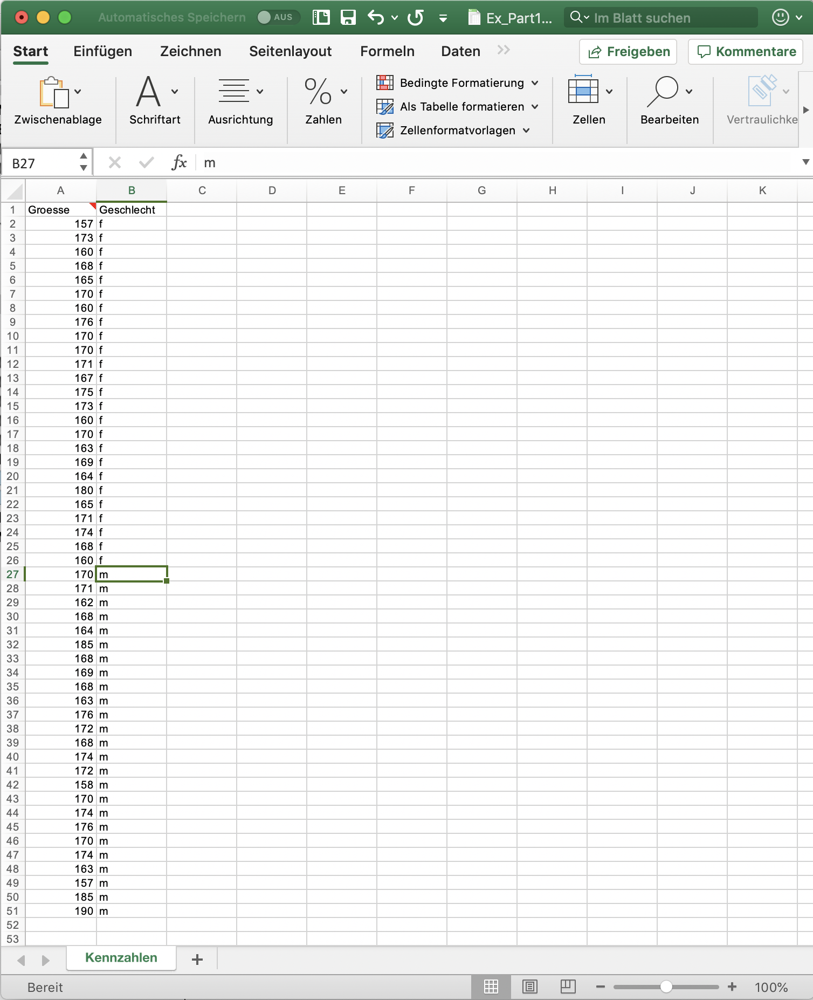{width=80% .lightbox}

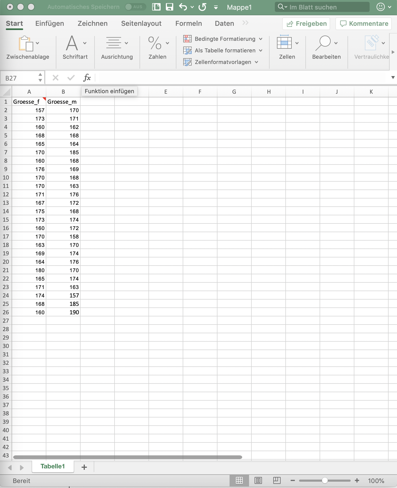{width=80% .lightbox}

:::

## Aufgabe 1 {.smaller}

1. Finde dich in jamovi zurecht und reproduziere die im [Tutorial Jamovi Basics](https://bern-movement-lab.github.io/statworkshop/bsc/Intro-Jamovi.html#jamovi-basics) gezeigten Schritte.
2. Analysiere die Daten getrennt nach Männern und Frauen in jamovi mithilfe der deskriptiven Statistik. Nutze dafür in jamovi die Variable `Geschlecht` als Split-by-Variable.
3. Speichere deine Analyse als `*.omv` Datei.
4. Kopiere eine Tabelle und eine Grafik in dein gewohntes Textverarbeitungsprogramm (z.B. Word).

## Aufgabe 2 {.smaller}

Bringe die Daten ins Wide-Format (separate Spalten für Männer und Frauen) und importiere sie in jamovi. Erstelle erneut deskriptive Statistiken für die Männer und die Frauen. Welche Unterschiede im Vergleich mit dem Long-Table Format stellst du fest?

## Aufgabe 3 {.smaller}

Siehe [Tutorial Aufgabe 3](https://bern-movement-lab.github.io/statworkshop/bsc/Intro-Jamovi.html#aufgabe-3-1)

Finde dich in jamovi zurecht und reproduziere die im [Tutorial Jamovi Advanced](https://bern-movement-lab.github.io/statworkshop/bsc/Intro-Jamovi.html#jamovi-advanced) gezeigten Schritte zum Codieren, Berechnen und Transformieren von Variablen und zum Filtern von Teilmengen des Datensatzes.

## Aufgabe 4 {.smaller}

Siehe [Tutorial Aufgabe 4](https://bern-movement-lab.github.io/statworkshop/bsc/Intro-Jamovi.html#aufgabe-4-1)

- Importiere den Datensatz in jamovi. Stelle sicher, dass Körpergrösse und Körpergewicht das Skalenniveau `Kontinuierlich` und das Geschlecht das Skalenniveau `Nominal` haben.
- Recodiere die Variable `Geschlecht` in f (weiblich) und m (männlich).
- Berechne den Body Mass Index (BMI) als neue Variable mit $\text{BMI}=\frac{\text{Körpergewicht}}{\text{Körpergrösse}^2}$. Dazu ist in jamovi *Data > Compute* zu verwenden.
- Kreiere eine neue Variable `BMIcat`, welche den BMI in Untergewicht, Normalgewicht (BMI 20 bis 25) und Übergewicht kategorisiert. Benutze dazu in jamovi *Data > Transformation*.
- Berechne mit Hilfe eines Filters eine deskriptive Statistik für alle weiblichen Personen mit Normalgewicht.

