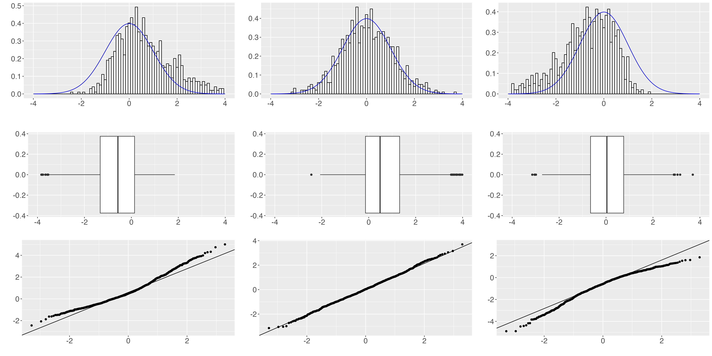

## Aufgabe 1

```{r}
#| echo: FALSE

# Preamble with generally used stuff
library(tidyverse) # load the tidyverse package
library(gridExtra) # to create subplots
library(readxl) # for importing Excel spreadsheets
library(car) # qqplot with confidence bounds
library(cowplot) # plot_grid
library(gamlss)
library(jmv) # jamovi library
library(moments) # to calculate skewness and kurtosis
library(pastecs) # descriptive statistics of data frame
library(data.table) # provides fread()
library(patchwork)
set.seed(10)
n<-1000 # Number of samples to draw from distribution
binwidth <- 0.1

########## Samples from an exponential distribution ###########
# z.B. Beantwortung der Frage nach der Dauer von zufälligen Zeitintervallen
# (Zeit zwischen Anrufen, Lebensdauer von Atomen beim radioaktiven Zerfall,
# Lebensdauer von Bautteilen)
expsamples <- rexp(n,rate=2)
# hist(expsamples)

########## Samples from a left skewed beta distribution ##########
p <- 5
q <- 2
betasamples <- rbeta(n,p,q)
# hist(betasamples)

######### Samples from a uniform distribution ###########
unisamples <- runif(n,min=0,max=1)
# hist(unisamples)

######### Samples from a binomial distribution ##########
binsamples <- rbinom(n, 10, 0.1)

####### Samples from a normal distribution ########
mn <- 0
sd <- 1
# normsamples <- rnorm(n,mean=mn,sd=sd)
# The rSHASH function from the GAMLSS package lets us to
# draw samples from skewed and arced normal distibutions.
normsamples <- rSHASHo(n, mu = mn, sigma = sd, nu = 0, tau = 1)

######### Skewed normal ##########
negskewsamples <- rSHASHo(n, mu = mn, sigma = sd, nu = -0.5, tau = 1)
posskewsamples <- rSHASHo(n, mu = mn, sigma = sd, nu = 0.5, tau = 1)

######### Kurtosis normal ##########
negkurtsamples <- rSHASHo(n, mu = mn, sigma = sd, nu = 0, tau = 1.2)
poskurtsamples <- rSHASHo(n, mu = mn, sigma = sd, nu = 0, tau = 0.8)

###### Put all in a data frame ######
distrdf <- data.frame(
  normsamples,
  expsamples,
  betasamples,
  unisamples,
  binsamples,
  posskewsamples,
  negskewsamples,
  poskurtsamples,
  negkurtsamples)

# stat.desc(distrdf, norm=T)
desc <- descriptives(distrdf,
             skew = T,
             kurt = T)
distr_descdf <- desc[[1]]$asDF

# Save values for exercises
## exportdf <- dplyr::select(distrdf,c(
##   normsamples,
##   posskewsamples,
##   negskewsamples,
##   poskurtsamples,
##   negkurtsamples))
exportdf <- dplyr::select(distrdf,c(
  normsamples,
  posskewsamples,
  negskewsamples))
names(exportdf) <- c("Data1","Data2","Data3")
write.csv(exportdf,"../data/ExampleDistributions.csv")
```

```{r}
#| echo: FALSE

# Plot normal samples
xmin <- -4
xmax <- 4
fsize <- 15

############################# Histogram ##################################
plt_norm_hist <- ggplot(distrdf, aes(x=normsamples)) +
  # geom_histogram(binwidth = binwidth, colour="black", fill="white") +
  geom_histogram(aes(y = ..density..), binwidth = binwidth, colour="black", fill="white") +
  # geom_density(colour="blue") +
  stat_function(
    fun = function(x, mean, sd){
      dnorm(x=x, mean=mean, sd=sd)
    },
    args = c(mean = mn, sd = sd), colour="blue") +
  labs(title = paste("Normalverteilung,",
                     "Skew:",round(distr_descdf$`normsamples[skew]`,digits=2),
                     ", Kurt:",round(distr_descdf$`normsamples[kurt]`,digits=2)),
       x = "", y = "") +
  theme(text = element_text(size = fsize), axis.text = element_text(size = fsize)) +
  xlim(xmin,xmax)
## plt_norm_hist
## ggsave("Ex_Part2_Normalverteilung.png", plot = plt_norm_hist)

# no title for exercise
plt_norm_hist_nolabels <- ggplot(distrdf, aes(x=normsamples)) +
  # geom_histogram(binwidth = binwidth, colour="black", fill="white") +
  geom_histogram(aes(y = ..density..), binwidth = binwidth, colour="black", fill="white") +
  # geom_density(colour="blue") +
  stat_function(
    fun = function(x, mean, sd){
      dnorm(x=x, mean=mean, sd=sd)
    },
    args = c(mean = mn, sd = sd), colour="blue") +
  labs(x = "", y = "") +
  theme(text = element_text(size = fsize), axis.text = element_text(size = fsize)) +
  xlim(xmin,xmax)
## plt_norm_hist_nolabels
## ggsave("Ex_Part2_Normalverteilung_nolabels.png", plot = plt_norm_hist_nolabels)

############################## Quantile function #############################
# Verteilungsfunktion rechnen
distr = ecdf(distrdf$normsamples)
# Quantilfunktion rechnen
p = seq(0,1,0.01)
quant = quantile(distr, probs = p)
# Verteilungsfunktion und Quantilfunktion der Normalverteilung
x <- seq(-4, 4, by = 0.01)
normaldistr = pnorm(x,mean(distrdf$normsamples),sd(distrdf$normsamples))
normalquant = qnorm(normaldistr,mean(distrdf$normsamples),sd(distrdf$normsamples))
df1 <- data.frame(p,quant)
df2 <- data.frame(normaldistr,normalquant)
plt_norm_q <- ggplot() +
  geom_point(data = df1, aes(x=p, y=quant)) +
  geom_line(data = df2, aes(x=normaldistr, y=normalquant), colour="blue", linewidth=1) +
  labs(title = paste("Normalverteilung,",
                     "Skew:",round(distr_descdf$`normsamples[skew]`,digits=2),
                     ", Kurt:",round(distr_descdf$`normsamples[kurt]`,digits=2)),
       x = "", y = "") +
  theme(text = element_text(size = fsize), axis.text = element_text(size = fsize))
## plt_norm_q
## ggsave("Ex_Part2_Normalverteilung_Q.png", plot = plt_norm_q)

# no title for exercise
plt_norm_q_nolabels <- ggplot() +
  geom_point(data = df1, aes(x=p, y=quant)) +
  geom_line(data = df2, aes(x=normaldistr, y=normalquant), colour="blue", linewidth=1) +
  labs(x = "", y = "") +
  theme(text = element_text(size = fsize), axis.text = element_text(size = fsize))
## plt_norm_q_nolabels
## ggsave("Ex_Part2_Normalverteilung_Q_nolabels.png", plot = plt_norm_q_nolabels)

############################# QQ-Plot ##################################
plt_norm_qq <- ggplot(distrdf, aes(sample=normsamples)) + stat_qq() +
  stat_qq_line() +
  labs(title = paste("Normalverteilung,",
                     "Skew:",round(distr_descdf$`normsamples[skew]`,digits=2),
                     ", Kurt:",round(distr_descdf$`normsamples[kurt]`,digits=2)),
       x = "", y = "") +
  theme(text = element_text(size = fsize), axis.text = element_text(size = fsize))
## plt_norm_qq
## ggsave("Ex_Part2_Normalverteilung_QQ.png", plot = plt_norm_qq)

# no title for exercise
plt_norm_qq_nolabels <- ggplot(distrdf, aes(sample=normsamples)) + stat_qq() +
  stat_qq_line() +
  labs(x = "", y = "") +
  theme(text = element_text(size = fsize), axis.text = element_text(size = fsize))
## plt_norm_qq_nolabels
## ggsave("Ex_Part2_Normalverteilung_QQ_nolabels.png", plt_norm_qq_nolabels)

############################# Boxplot ##################################
plt_norm_bp <- ggplot(distrdf, aes(x=normsamples)) +
  geom_boxplot() +
  labs(title = paste("Normalverteilung,",
                     "Skew:",round(distr_descdf$`normsamples[skew]`,digits=2),
                     ", Kurt:",round(distr_descdf$`normsamples[kurt]`,digits=2)),
       x = "", y = "") +
  theme(text = element_text(size = fsize), axis.text = element_text(size = fsize)) +
  xlim(xmin,xmax)
## plt_norm_bp
## ggsave("Ex_Part2_Normalverteilung_BoxPlot.png", plot = plt_norm_bp)

# no title for exercise
plt_norm_bp_nolabels <- ggplot(distrdf, aes(x=normsamples)) +
  geom_boxplot() +
  labs(title = "", x = "", y = "") +
  theme(text = element_text(size = fsize), axis.text = element_text(size = fsize)) +
  xlim(xmin,xmax)
## plt_norm_bp_nolabels
## ggsave("Ex_Part2_Normalverteilung_BoxPlot_nolabels.png", plot = plt_norm_bp_nolabels)
```

```{r}
#| echo: FALSE
# Plot positive skew samples
############################# Histogram ##################################
plt_skewedpos_hist <- ggplot(distrdf, aes(x=posskewsamples)) +
  # geom_histogram(binwidth = binwidth, colour="black", fill="white") +
  geom_histogram(aes(y = ..density..), binwidth = binwidth, colour="black", fill="white") +
  # geom_density(colour="blue") +
  stat_function(
    fun = function(x, mean, sd){
      dnorm(x=x, mean=mean, sd=sd)
    },
    args = c(mean = mn, sd = sd), colour="blue") +
  labs(title = paste("Schief-Positiv,",
                     "Skew:",round(distr_descdf$`posskewsamples[skew]`,digits=2),
                     ", Kurt:",round(distr_descdf$`posskewsamples[kurt]`,digits=2)),
       x = "", y = "") +
  theme(text = element_text(size = fsize), axis.text = element_text(size = fsize)) +
  xlim(xmin,xmax)
## plt_skewedpos_hist
## ggsave("Ex_Part2_SkewedPos.png", plot = plt_skewedpos_hist)

# no title for exercise
plt_skewedpos_hist_nolabels <- ggplot(distrdf, aes(x=posskewsamples)) +
  # geom_histogram(binwidth = binwidth, colour="black", fill="white") +
  geom_histogram(aes(y = ..density..), binwidth = binwidth, colour="black", fill="white") +
  # geom_density(colour="blue") +
  stat_function(
    fun = function(x, mean, sd){
      dnorm(x=x, mean=mean, sd=sd)
    },
    args = c(mean = mn, sd = sd), colour="blue") +
  labs(x = "", y = "") +
  theme(text = element_text(size = fsize), axis.text = element_text(size = fsize)) +
  xlim(xmin,xmax)
## plt_skewedpos_hist_nolabels
## ggsave("Ex_Part2_SkewedPos_nolabels.png", plot = plt_skewedpos_hist_nolabels)

############################# QQ-Plot ##################################
plt_skewedpos_qq <- ggplot(distrdf, aes(sample=posskewsamples)) + stat_qq() +
  stat_qq_line() +
  labs(title = paste("Schief-Positiv,",
                     "Skew:",round(distr_descdf$`posskewsamples[skew]`,digits=2),
                     ", Kurt:",round(distr_descdf$`posskewsamples[kurt]`,digits=2)),
       x = "", y = "") +
  theme(text = element_text(size = fsize), axis.text = element_text(size = fsize))
## plt_skewedpos_qq
## ggsave("Ex_Part2_SkewedPos_QQ.png", plot = plt_skewedpos_qq)

# no title for exercise
plt_skewedpos_qq_nolabels <- ggplot(distrdf, aes(sample=posskewsamples)) + stat_qq() +
  stat_qq_line() +
  labs(x = "", y = "") +
  theme(text = element_text(size = fsize), axis.text = element_text(size = fsize))
## plt_skewedpos_qq_nolabels
## ggsave("Ex_Part2_SkewedPos_QQ_nolabels.png", plt_skewedpos_qq_nolabels)

############################## Quantile function #############################
# Verteilungsfunktion rechnen
distr = ecdf(distrdf$posskewsamples)
# Quantilfunktion rechnen
p = seq(0,1,0.01)
quant = quantile(distr, probs = p)
# Verteilungsfunktion und Quantilfunktion der Normalverteilung
x <- seq(-4, 4, by = 0.01)
normaldistr = pnorm(x,mean(distrdf$posskewsamples),sd(distrdf$posskewsamples))
normalquant = qnorm(normaldistr,mean(distrdf$posskewsamples),sd(distrdf$posskewsamples))
df1 <- data.frame(p,quant)
df2 <- data.frame(normaldistr,normalquant)
plt_skewedpos_q <- ggplot() +
  geom_point(data = df1, aes(x=p, y=quant)) +
  geom_line(data = df2, aes(x=normaldistr, y=normalquant), colour="blue", linewidth=1) +
  labs(title = paste("Schief-Positiv,",
                     "Skew:",round(distr_descdf$`posskewsamples[skew]`,digits=2),
                     ", Kurt:",round(distr_descdf$`posskewsamples[kurt]`,digits=2)),
       x = "", y = "") +
  theme(text = element_text(size = fsize), axis.text = element_text(size = fsize))
## plt_skewedpos_q
## ggsave("Ex_Part2_SkewedPos_Q.png", plot = plt_skewedpos_q)

# no title for exercise
plt_skewedpos_q_nolabels <- ggplot() +
  geom_point(data = df1, aes(x=p, y=quant)) +
  geom_line(data = df2, aes(x=normaldistr, y=normalquant), colour="blue", linewidth=1) +
  labs(x = "", y = "") +
  theme(text = element_text(size = fsize), axis.text = element_text(size = fsize))
## plt_skewedpos_q_nolabels
## ggsave("Ex_Part2_SkewedPos_Q_nolabels.png", plot = plt_skewedpos_q_nolabels)

############################# Boxplot ##################################
plt_skewedpos_bp <- ggplot(distrdf, aes(x=posskewsamples)) +
  geom_boxplot() +
  labs(title = paste("Schief-Positiv,",
                     "Skew:",round(distr_descdf$`posskewsamples[skew]`,digits=2),
                     ", Kurt:",round(distr_descdf$`posskewsamples[kurt]`,digits=2)),
       x = "", y = "") +
  theme(text = element_text(size = fsize), axis.text = element_text(size = fsize)) +
  xlim(xmin,xmax)
## plt_skewedpos_bp
## ggsave("Ex_Part2_SkewedPos_BoxPlot.png", plot = plt_skewedpos_bp)

# no title for exercise
plt_skewedpos_bp_nolabels <- ggplot(distrdf, aes(x=posskewsamples)) +
  geom_boxplot() +
  labs(title = "", x = "", y = "") +
  theme(text = element_text(size = fsize), axis.text = element_text(size = fsize)) +
  xlim(xmin,xmax)
## plt_skewedpos_bp_nolabels
## ggsave("Ex_Part2_SkewedPos_BoxPlot_nolabels.png", plot = plt_skewedpos_bp_nolabels)
```


```{r}
#| echo: FALSE
# Plot negative skew samples
############################# Histogram ##################################
plt_skewedneg_hist <- ggplot(distrdf, aes(x=negskewsamples)) +
  # geom_histogram(binwidth = binwidth, colour="black", fill="white") +
  geom_histogram(aes(y = ..density..), binwidth = binwidth, colour="black", fill="white") +
  # geom_density(colour="blue") +
  stat_function(
    fun = function(x, mean, sd){
      dnorm(x=x, mean=mean, sd=sd)
    },
    args = c(mean = mn, sd = sd), colour="blue") +
  labs(title = paste("Schief-Negativ,",
                     "Skew:",round(distr_descdf$`negskewsamples[skew]`,digits=2),
                     ", Kurt:",round(distr_descdf$`negskewsamples[kurt]`,digits=2)),
       x = "", y = "") +
  theme(text = element_text(size = fsize), axis.text = element_text(size = fsize)) +
  xlim(xmin,xmax)
## plt_skewedneg_hist
## ggsave("Ex_Part2_SkewedNeg.png", plot = plt_skewedneg_hist)

# no title for exercise
plt_skewedneg_hist_nolabels <- ggplot(distrdf, aes(x=negskewsamples)) +
  # geom_histogram(binwidth = binwidth, colour="black", fill="white") +
  geom_histogram(aes(y = ..density..), binwidth = binwidth, colour="black", fill="white") +
  # geom_density(colour="blue") +
  stat_function(
    fun = function(x, mean, sd){
      dnorm(x=x, mean=mean, sd=sd)
    },
    args = c(mean = mn, sd = sd), colour="blue") +
  labs(x = "", y = "") +
  theme(text = element_text(size = fsize), axis.text = element_text(size = fsize)) +
  xlim(xmin,xmax)
## plt_skewedneg_hist_nolabels
## ggsave("Ex_Part2_SkewedNeg_nolabels.png", plot = plt_skewedneg_hist_nolabels)

############################# QQ-Plot ##################################
plt_skewedneg_qq <- ggplot(distrdf, aes(sample=negskewsamples)) + stat_qq() +
  stat_qq_line() +
  labs(title = paste("Schief-Negativ,",
                     "Skew:",round(distr_descdf$`negskewsamples[skew]`,digits=2),
                     ", Kurt:",round(distr_descdf$`negskewsamples[kurt]`,digits=2)),
       x = "", y = "") +
  theme(text = element_text(size = fsize), axis.text = element_text(size = fsize))
## plt_skewedneg_qq
## ggsave("Ex_Part2_SkewedNeg_QQ.png", plot = plt_skewedneg_qq)

# no title for exercise
plt_skewedneg_qq_nolabels <- ggplot(distrdf, aes(sample=negskewsamples)) + stat_qq() +
  stat_qq_line() +
  labs(x = "", y = "") +
  theme(text = element_text(size = fsize), axis.text = element_text(size = fsize))
## plt_skewedneg_qq_nolabels
## ggsave("Ex_Part2_SkewedNeg_QQ_nolabels.png", plt_skewedneg_qq_nolabels)

############################## Quantile function #############################
# Verteilungsfunktion rechnen
distr = ecdf(distrdf$negskewsamples)
# Quantilfunktion rechnen
p = seq(0,1,0.01)
quant = quantile(distr, probs = p)
# Verteilungsfunktion und Quantilfunktion der Normalverteilung
x <- seq(-4, 4, by = 0.01)
normaldistr = pnorm(x,mean(distrdf$negskewsamples),sd(distrdf$negskewsamples))
normalquant = qnorm(normaldistr,mean(distrdf$negskewsamples),sd(distrdf$negskewsamples))
df1 <- data.frame(p,quant)
df2 <- data.frame(normaldistr,normalquant)
plt_skewedneg_q <- ggplot() +
  geom_point(data = df1, aes(x=p, y=quant)) +
  geom_line(data = df2, aes(x=normaldistr, y=normalquant), colour="blue", linewidth=1) +
  labs(title = paste("Schief-Negativ,",
                     "Skew:",round(distr_descdf$`negskewsamples[skew]`,digits=2),
                     ", Kurt:",round(distr_descdf$`negskewsamples[kurt]`,digits=2)),
       x = "", y = "") +
  theme(text = element_text(size = fsize), axis.text = element_text(size = fsize))
## plt_skewedneg_q
## ggsave("Ex_Part2_SkewedPos_Q.png", plot = plt_skewedneg_q)

# no title for exercise
plt_skewedneg_q_nolabels <- ggplot() +
  geom_point(data = df1, aes(x=p, y=quant)) +
  geom_line(data = df2, aes(x=normaldistr, y=normalquant), colour="blue", linewidth=1) +
  labs(x = "", y = "") +
  theme(text = element_text(size = fsize), axis.text = element_text(size = fsize))
## plt_skewedneg_q_nolabels
## ggsave("Ex_Part2_SkewedPos_Q_nolabels.png", plot = plt_skewedneg_q_nolabels)

############################# Boxplot ##################################
plt_skewedneg_bp <- ggplot(distrdf, aes(x=negskewsamples)) +
  geom_boxplot() +
  labs(title = paste("Schief-Negativ,",
                     "Skew:",round(distr_descdf$`negskewsamples[skew]`,digits=2),
                     ", Kurt:",round(distr_descdf$`negskewsamples[kurt]`,digits=2)),
       x = "", y = "") +
  theme(text = element_text(size = fsize), axis.text = element_text(size = fsize)) +
  xlim(xmin,xmax)
## plt_skewedneg_bp
## ggsave("Ex_Part2_SkewedNeg_BoxPlot.png", plot = plt_skewedneg_bp)

# no title for exercise
plt_skewedneg_bp_nolabels <- ggplot(distrdf, aes(x=negskewsamples)) +
  geom_boxplot() +
  labs(title = "", x = "", y = "") +
  theme(text = element_text(size = fsize), axis.text = element_text(size = fsize)) +
  xlim(xmin,xmax)
## plt_skewedneg_bp_nolabels
## ggsave("Ex_Part2_SkewedNeg_BoxPlot_nolabels.png", plot = plt_skewedneg_bp_nolabels)
```


```{r}
#| echo: FALSE

# Plot flatened samples
############################# Histogram ##################################
plt_kurtneg_hist <- ggplot(distrdf, aes(x=negkurtsamples)) +
  # geom_histogram(binwidth = binwidth, colour="black", fill="white") +
  geom_histogram(aes(y = ..density..), binwidth = binwidth, colour="black", fill="white") +
  # geom_density(colour="blue") +
  stat_function(
    fun = function(x, mean, sd){
      dnorm(x=x, mean=mean, sd=sd)
    },
    args = c(mean = mn, sd = sd), colour="blue") +
  labs(title = paste("Flachgipflig,",
                     "Skew:",round(distr_descdf$`negkurtsamples[skew]`,digits=2),
                     ", Kurt:",round(distr_descdf$`negkurtsamples[kurt]`,digits=2)),
       x = "", y = "") +
  theme(text = element_text(size = fsize), axis.text = element_text(size = fsize)) +
  xlim(xmin,xmax)
## plt_kurtneg_hist
## ggsave("Ex_Part2_KurtNeg.png", plot = plt_kurtneg_hist)

# no title for exercise
plt_kurtneg_hist_nolabels <- ggplot(distrdf, aes(x=negkurtsamples)) +
  # geom_histogram(binwidth = binwidth, colour="black", fill="white") +
  geom_histogram(aes(y = ..density..), binwidth = binwidth, colour="black", fill="white") +
  # geom_density(colour="blue") +
  stat_function(
    fun = function(x, mean, sd){
      dnorm(x=x, mean=mean, sd=sd)
    },
    args = c(mean = mn, sd = sd), colour="blue") +
  labs(x = "", y = "") +
  theme(text = element_text(size = fsize), axis.text = element_text(size = fsize)) +
  xlim(xmin,xmax)
## plt_kurtneg_hist_nolabels
## ggsave("Ex_Part2_KurtNeg_nolabels.png", plot = plt_kurtneg_hist_nolabels)

############################# QQ-Plot ##################################
plt_kurtneg_qq <- ggplot(distrdf, aes(sample=negkurtsamples)) + stat_qq() +
  stat_qq_line() +
  labs(title = paste("Flachgipflig,",
                     "Skew:",round(distr_descdf$`negkurtsamples[skew]`,digits=2),
                     ", Kurt:",round(distr_descdf$`negkurtsamples[kurt]`,digits=2)),
       x = "", y = "") +
  theme(text = element_text(size = fsize), axis.text = element_text(size = fsize))
## plt_kurtneg_qq
## ggsave("Ex_Part2_KurtNeg_QQ.png", plot = plt_kurtneg_qq)

# no title for exercise
plt_kurtneg_qq_nolabels <- ggplot(distrdf, aes(sample=negkurtsamples)) + stat_qq() +
  stat_qq_line() +
  labs(x = "", y = "") +
  theme(text = element_text(size = fsize), axis.text = element_text(size = fsize))
## plt_kurtneg_qq_nolabels
## ggsave("Ex_Part2_KurtNeg_QQ_nolabels.png", plt_kurtneg_qq_nolabels)

############################## Quantile function #############################
# Verteilungsfunktion rechnen
distr = ecdf(distrdf$negkurtsamples)
# Quantilfunktion rechnen
p = seq(0,1,0.01)
quant = quantile(distr, probs = p)
# Verteilungsfunktion und Quantilfunktion der Normalverteilung
x <- seq(-4, 4, by = 0.01)
normaldistr = pnorm(x,mean(distrdf$negkurtsamples),sd(distrdf$negkurtsamples))
normalquant = qnorm(normaldistr,mean(distrdf$negkurtsamples),sd(distrdf$negkurtsamples))
df1 <- data.frame(p,quant)
df2 <- data.frame(normaldistr,normalquant)
plt_kurtneg_q <- ggplot() +
  geom_point(data = df1, aes(x=p, y=quant)) +
  geom_line(data = df2, aes(x=normaldistr, y=normalquant), colour="blue", linewidth=1) +
  labs(title = paste("Flachgipflig,",
                     "Skew:",round(distr_descdf$`negkurtsamples[skew]`,digits=2),
                     ", Kurt:",round(distr_descdf$`negkurtsamples[kurt]`,digits=2)),
       x = "", y = "") +
  theme(text = element_text(size = fsize), axis.text = element_text(size = fsize))
## plt_kurtneg_q
## ggsave("Ex_Part2_SkewedPos_Q.png", plot = plt_kurtneg_q)

# no title for exercise
plt_kurtneg_q_nolabels <- ggplot() +
  geom_point(data = df1, aes(x=p, y=quant)) +
  geom_line(data = df2, aes(x=normaldistr, y=normalquant), colour="blue", linewidth=1) +
  labs(x = "", y = "") +
  theme(text = element_text(size = fsize), axis.text = element_text(size = fsize))
## plt_kurtneg_q_nolabels
## ggsave("Ex_Part2_SkewedPos_Q_nolabels.png", plot = plt_kurtneg_q_nolabels)

############################# Boxplot ##################################
plt_kurtneg_bp <- ggplot(distrdf, aes(x=negkurtsamples)) +
  geom_boxplot() +
  labs(title = paste("Flachgipflig,",
                     "Skew:",round(distr_descdf$`negkurtsamples[skew]`,digits=2),
                     ", Kurt:",round(distr_descdf$`negkurtsamples[kurt]`,digits=2)),
       x = "", y = "") +
  theme(text = element_text(size = fsize), axis.text = element_text(size = fsize)) +
  xlim(xmin,xmax)
## plt_kurtneg_bp
## ggsave("Ex_Part2_KurtNeg_BoxPlot.png", plot = plt_kurtneg_bp)

# no title for exercise
plt_kurtneg_bp_nolabels <- ggplot(distrdf, aes(x=negkurtsamples)) +
  geom_boxplot() +
  labs(title = "", x = "", y = "") +
  theme(text = element_text(size = fsize), axis.text = element_text(size = fsize)) +
  xlim(xmin,xmax)
## plt_kurtneg_bp_nolabels
## ggsave("Ex_Part2_KurtNeg_BoxPlot_nolabels.png", plot = plt_kurtneg_bp_nolabels)
```

```{r}
#| out.width: "80%"
#| fig.align: "center"
#| echo: FALSE
# Plot peaked samples
############################# Histogram ##################################
plt_kurtpos_hist <- ggplot(distrdf, aes(x=poskurtsamples)) +
  # geom_histogram(binwidth = binwidth, colour="black", fill="white") +
  geom_histogram(aes(y = ..density..), binwidth = binwidth, colour="black", fill="white") +
  # geom_density(colour="blue") +
  stat_function(
    fun = function(x, mean, sd){
      dnorm(x=x, mean=mean, sd=sd)
    },
    args = c(mean = mn, sd = sd), colour="blue") +
  labs(title = paste("Steilgipflig,",
                     "Skew:",round(distr_descdf$`poskurtsamples[skew]`,digits=2),
                     ", Kurt:",round(distr_descdf$`poskurtsamples[kurt]`,digits=2)),
       x = "", y = "") +
  theme(text = element_text(size = fsize), axis.text = element_text(size = fsize)) +
  xlim(xmin,xmax)
## plt_kurtpos_hist
## ggsave("Ex_Part2_KurtPos.png", plot = plt_kurtpos_hist)

# no title for exercise
plt_kurtpos_hist_nolabels <- ggplot(distrdf, aes(x=poskurtsamples)) +
  # geom_histogram(binwidth = binwidth, colour="black", fill="white") +
  geom_histogram(aes(y = ..density..), binwidth = binwidth, colour="black", fill="white") +
  # geom_density(colour="blue") +
  stat_function(
    fun = function(x, mean, sd){
      dnorm(x=x, mean=mean, sd=sd)
    },
    args = c(mean = mn, sd = sd), colour="blue") +
  labs(x = "", y = "") +
  theme(text = element_text(size = fsize), axis.text = element_text(size = fsize)) +
  xlim(xmin,xmax)
## plt_kurtpos_hist_nolabels
## ggsave("Ex_Part2_KurtPos_nolabels.png", plot = plt_kurtpos_hist_nolabels)

############################# QQ-Plot ##################################
plt_kurtpos_qq <- ggplot(distrdf, aes(sample=poskurtsamples)) + stat_qq() +
  stat_qq_line() +
  labs(title = paste("Steilgipflig,",
                     "Skew:",round(distr_descdf$`poskurtsamples[skew]`,digits=2),
                     ", Kurt:",round(distr_descdf$`poskurtsamples[kurt]`,digits=2)),
       x = "", y = "") +
  theme(text = element_text(size = fsize), axis.text = element_text(size = fsize))
## plt_kurtpos_qq
## ggsave("Ex_Part2_KurtPos_QQ.png", plot = plt_kurtpos_qq)

# no title for exercise
plt_kurtpos_qq_nolabels <- ggplot(distrdf, aes(sample=poskurtsamples)) + stat_qq() +
  stat_qq_line() +
  labs(x = "", y = "") +
  theme(text = element_text(size = fsize), axis.text = element_text(size = fsize))
## plt_kurtpos_qq_nolabels
## ggsave("Ex_Part2_KurtPos_QQ_nolabels.png", plt_kurtpos_qq_nolabels)

############################## Quantile function #############################
# Verteilungsfunktion rechnen
distr = ecdf(distrdf$poskurtsamples)
# Quantilfunktion rechnen
p = seq(0,1,0.01)
quant = quantile(distr, probs = p)
# Verteilungsfunktion und Quantilfunktion der Normalverteilung
x <- seq(-4, 4, by = 0.01)
normaldistr = pnorm(x,mean(distrdf$poskurtsamples),sd(distrdf$poskurtsamples))
normalquant = qnorm(normaldistr,mean(distrdf$poskurtsamples),sd(distrdf$poskurtsamples))
df1 <- data.frame(p,quant)
df2 <- data.frame(normaldistr,normalquant)
plt_kurtpos_q <- ggplot() +
  geom_point(data = df1, aes(x=p, y=quant)) +
  geom_line(data = df2, aes(x=normaldistr, y=normalquant), colour="blue", linewidth=1) +
  labs(title = paste("Steilgipflig,",
                     "Skew:",round(distr_descdf$`poskurtsamples[skew]`,digits=2),
                     ", Kurt:",round(distr_descdf$`poskurtsamples[kurt]`,digits=2)),
       x = "", y = "") +
  theme(text = element_text(size = fsize), axis.text = element_text(size = fsize))
## plt_kurtpos_q
## ggsave("Ex_Part2_SkewedPos_Q.png", plot = plt_kurtpos_q)

# no title for exercise
plt_kurtpos_q_nolabels <- ggplot() +
  geom_point(data = df1, aes(x=p, y=quant)) +
  geom_line(data = df2, aes(x=normaldistr, y=normalquant), colour="blue", linewidth=1) +
  labs(x = "", y = "") +
  theme(text = element_text(size = fsize), axis.text = element_text(size = fsize))
## plt_kurtpos_q_nolabels
## ggsave("Ex_Part2_SkewedPos_Q_nolabels.png", plot = plt_kurtpos_q_nolabels)

############################# Boxplot ##################################
plt_kurtpos_bp <- ggplot(distrdf, aes(x=poskurtsamples)) +
  geom_boxplot() +
  labs(title = paste("Steilgipflig,",
                     "Skew:",round(distr_descdf$`poskurtsamples[skew]`,digits=2),
                     ", Kurt:",round(distr_descdf$`poskurtsamples[kurt]`,digits=2)),
       x = "", y = "") +
  theme(text = element_text(size = fsize), axis.text = element_text(size = fsize)) +
  xlim(xmin,xmax)
## plt_kurtpos_bp
## ggsave("Ex_Part2_KurtPos_BoxPlot.png", plot = plt_kurtpos_bp)

# no title for exercise
plt_kurtpos_bp_nolabels <- ggplot(distrdf, aes(x=poskurtsamples)) +
  geom_boxplot() +
  labs(title = "", x = "", y = "") +
  theme(text = element_text(size = fsize), axis.text = element_text(size = fsize)) +
  xlim(xmin,xmax)
## plt_kurtpos_bp_nolabels
## ggsave("Ex_Part2_KurtPos_BoxPlot_nolabels.png", plot = plt_kurtpos_bp_nolabels)
```

```{r}
#| echo: FALSE
## p <- plot_grid(plt_kurtneg_hist_nolabels, plt_skewedpos_hist_nolabels, plt_norm_hist_nolabels, plt_skewedneg_hist_nolabels,plt_kurtpos_hist_nolabels,
##                plt_skewedneg_bp_nolabels, plt_norm_bp_nolabels, plt_kurtpos_bp_nolabels, plt_skewedpos_bp_nolabels, plt_kurtneg_bp_nolabels,
##                plt_skewedpos_qq_nolabels, plt_norm_qq_nolabels,  plt_skewedneg_qq_nolabels, plt_kurtneg_qq_nolabels, plt_kurtpos_qq_nolabels,  nrow = 3)
p <- plot_grid(plt_skewedpos_hist_nolabels, plt_norm_hist_nolabels, plt_skewedneg_hist_nolabels,
               plt_skewedneg_bp_nolabels, plt_skewedpos_bp_nolabels, plt_norm_bp_nolabels,
               plt_skewedpos_qq_nolabels, plt_norm_qq_nolabels,  plt_skewedneg_qq_nolabels,  nrow = 3)
ggsave("../images/WS2_DistrExamples_problem.png", p, width = 20, height = 10)
## (plt_kurtneg_hist_nolabels | plt_skewedpos_hist_nolabels | plt_norm_hist_nolabels | plt_skewedneg_hist_nolabels | plt_kurtpos_hist_nolabels) /
##   (plt_skewedneg_bp_nolabels | plt_norm_bp_nolabels | plt_kurtpos_bp_nolabels | plt_skewedpos_bp_nolabels | plt_kurtneg_bp_nolabels) /
##   (plt_skewedpos_qq_nolabels | plt_norm_qq_nolabels | plt_skewedneg_qq_nolabels | plt_kurtneg_qq_nolabels | plt_kurtpos_qq_nolabels)
```

```{r}
#| echo: FALSE
## Exercise with labels
## p <- plot_grid(plt_kurtneg_hist, # 5
##                plt_skewedpos_hist, # 2
##                plt_norm_hist, # 1
##                plt_skewedneg_hist, # 3
##                plt_kurtpos_hist, # 4
               
##                plt_skewedneg_bp, # 3
##                plt_norm_bp, # 1
##                plt_kurtpos_bp, # 4
##                plt_skewedpos_bp, # 2
##                plt_kurtneg_bp, # 5
               
##                plt_skewedpos_qq, # 2
##                plt_norm_qq, # 1
##                plt_skewedneg_qq, # 3
##                plt_kurtneg_qq, # 5
##                plt_kurtpos_qq,  # 4
##                labels = c("D5","D2","D1","D3","D4",
##                           "D3","D1","D4","D2","D5",
##                           "D2","D1","D3","D5","D4"), nrow = 3)
p <- plot_grid(
               plt_skewedpos_hist, # 2
               plt_norm_hist, # 1
               plt_skewedneg_hist, # 3
               
               plt_skewedneg_bp, # 3
               plt_skewedpos_bp, # 2
               plt_norm_bp, # 1
               
               plt_skewedpos_qq, # 2
               plt_norm_qq, # 1
               plt_skewedneg_qq, # 3

               labels = c("D2","D1","D3",
                          "D3","D2","D1",
                          "D2","D1","D3"), nrow = 3)
ggsave("../images/WS2_DistrExamples_problem_labelled.png", p, width = 20, height = 10)
```

```{r}
#| echo: FALSE
# Solution to exercise
p <- plot_grid(plt_norm_hist,plt_skewedpos_hist, plt_skewedneg_hist,
               plt_norm_bp, plt_skewedpos_bp, plt_skewedneg_bp,
               plt_norm_qq, plt_skewedpos_qq, plt_skewedneg_qq,
               labels = c("D1","D2","D3",
                          "D1","D2","D3",
                          "D1","D2","D3"), nrow = 3)
## p
ggsave("../images/WS2_DistrExamples_solution.png", p, width = 20, height = 10)
```

Ordne zu.



## Aufgabe 2

Flächen der Standard Normalverteilung

## Aufgabe 3

Wahrscheinlichkeit der Normalverteilung.

## Aufgabe 4

Körpergewicht: Wahrscheinlichkeit und Quantile

## Aufgabe 5

Normalverteilung Geburtsgewicht.
